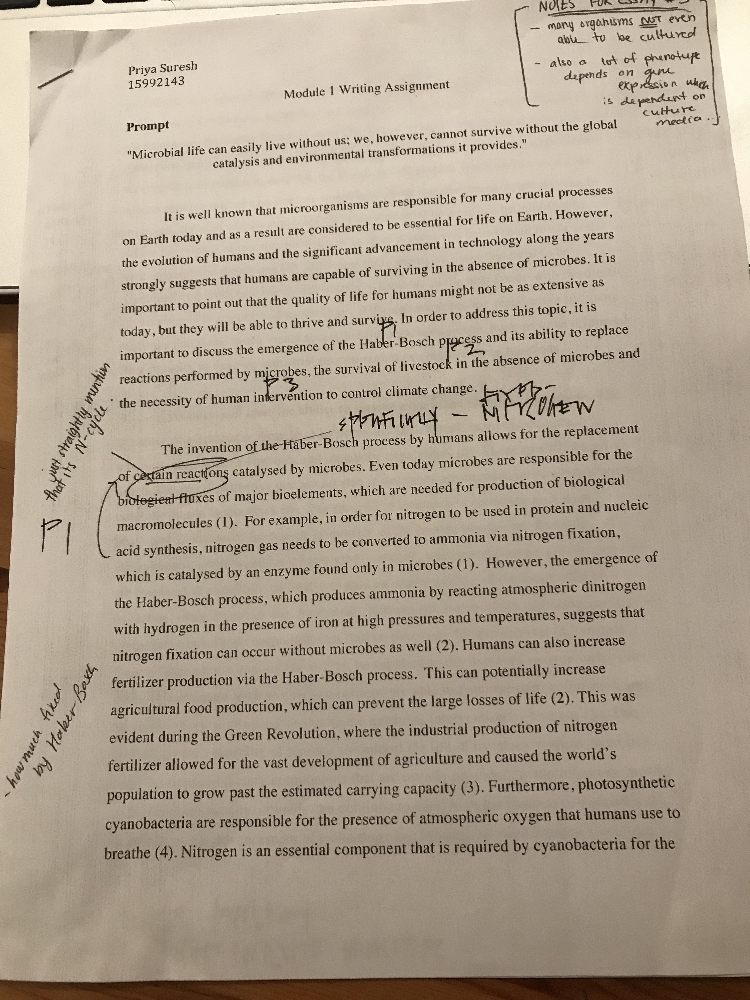
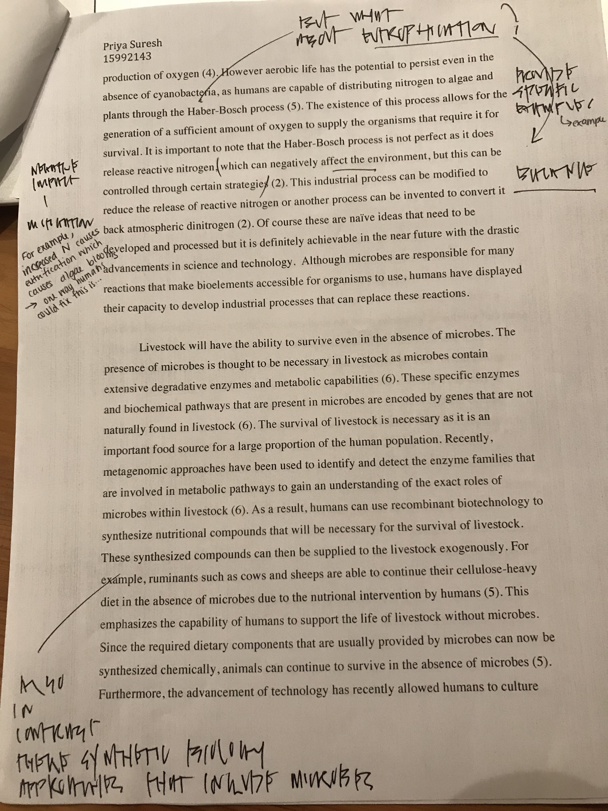
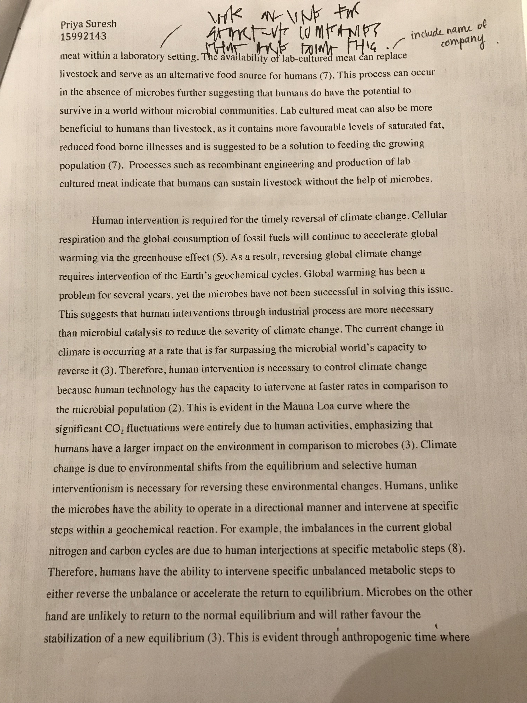
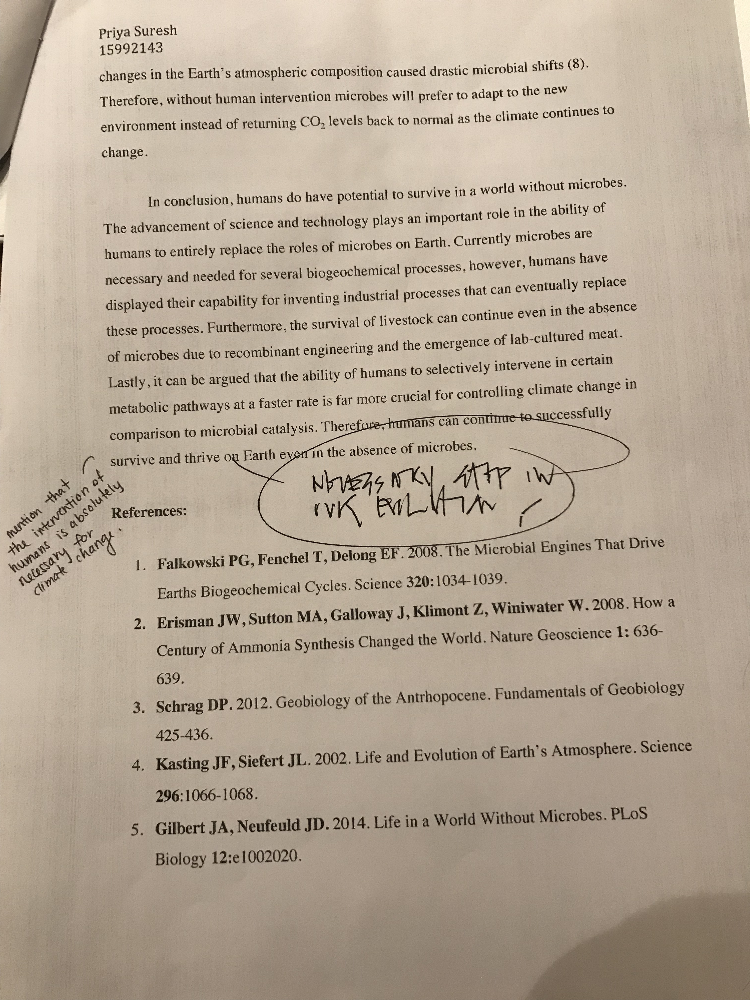
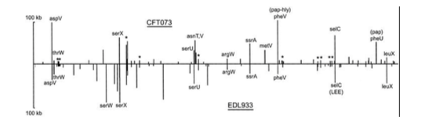
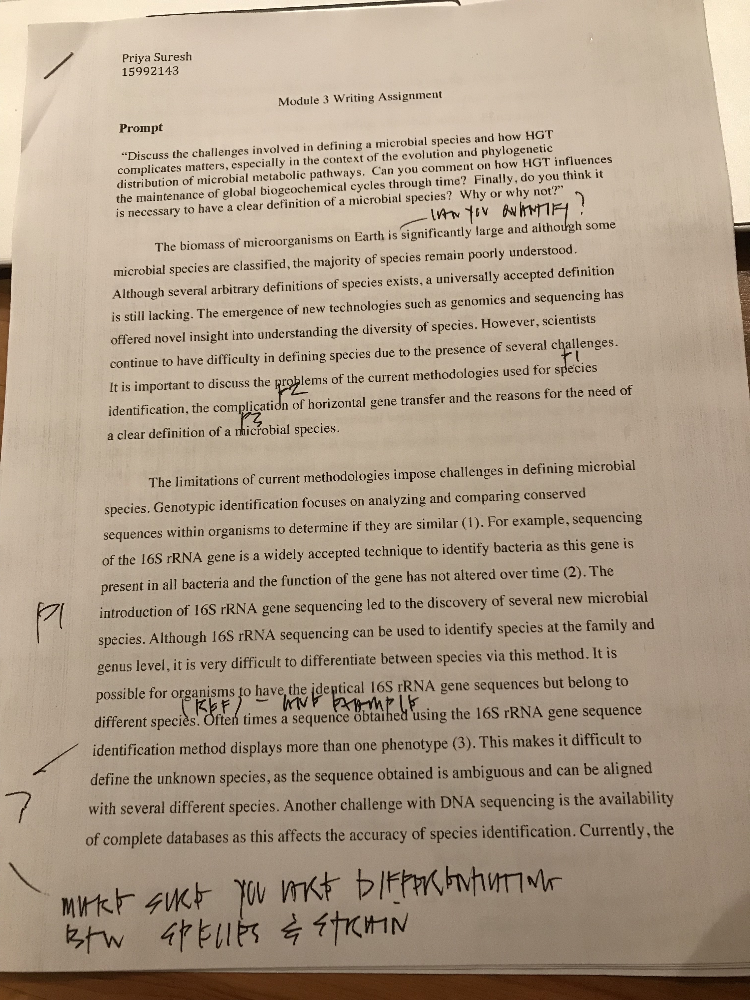
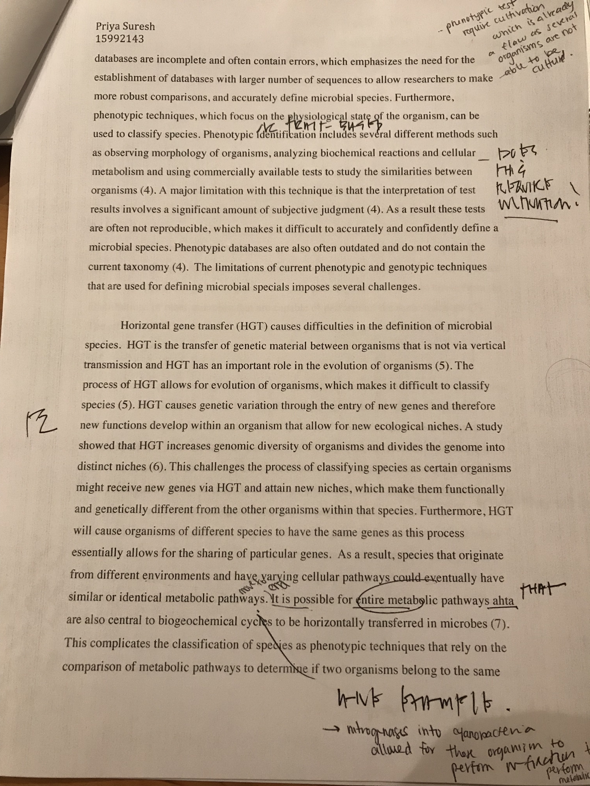
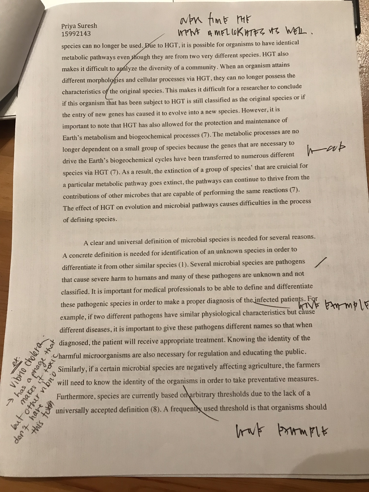
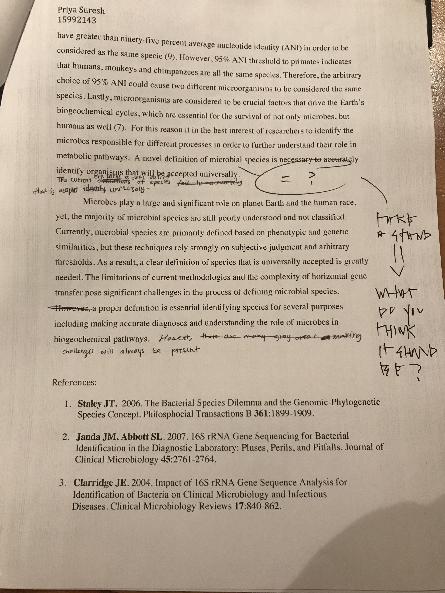

# Module 01

## Module 01 portfolio content

* Installation check
    + Completion status:
    + Comments:
* Portfolio repo setup
    + Completion status: 
    + Comments:
* RMarkdown Pretty html Challenge
    + Completion status:
    + Comments:
* Evidence worksheet_01
    + Completion status:
    + Comments:
* Evidence worksheet_02
    + Completion status:
    + Comments:
* Evidence worksheet_03
    + Completion status:
    + Comments:
* Problem Set_01
    + Completion status:
    + Comments:
* Problem Set_02
    + Completion status:
    + Comments:
* Writing assessment_01
    + Completion status:
    + Comments:
* Additional Readings
    + Completion status:
    + Comments  
    


## Origins and Earth Systems
### Evidence worksheet 01 

[Whitman *et al* 1998](https://www.ncbi.nlm.nih.gov/pmc/articles/PMC33863/)

#### Learning objectives
Describe the numerical abundance of microbial life in relation to ecology and biogeochemistry of Earth systems. 

#### General questions
* **What were the main questions being asked?**  
There are two main questions that are asked in this article. One of the main questions that is asked is the estimated number of prokaryotes in the different environments including aquatic, soil, oceanic and terrestrial subsurfaces.  Second, the article also asks hows much cellular carbon prokaryotes contribute to the total amount of carbon on Earth. 

* **What were the primary methodological approaches used?**  
To calculate the number of prokaryotes in the oceanic reservoir, polar region and frewshwater/saline lakes, cellular density was multiplied to global estimates of ocean/lake volume to determine the total number of cells. For the polar region, data from existing literature was used for the estimated number of prokaryotes and they used mean area extent of seasonal ice. To calculate prokaryotes in the soil, cellular density was measured using dfirect counts from forest soil and past field studies. These values were used in addition to previously estimated amounts of soil on Earth to calculate the total prokaryotic abundance in the soil. To calculate the number of prokaryotes in the terrestrial subsurface they estimated the number of prokaryotes in groundwater based on values from several sites. These values were multiplied using the estimated value of groundwater on Earth. In addition, they also did a separate calculation using the average porosity of Earth’s soil and used known values of space occupied by prokaryotes within these pores. To calculate the carbon content and prduction by prokaryotes, the dry weight of cells was first calculated. Two important assumptions were made, first It was assumed that the amount of carbon in prokaryotes was equal to half of their dry weight. Second, it was assumed that the amount of carbon produced during each turnover is about four times their carbon content. These two assumptions and the prokaryotic turnover rates were used to calculate the production of carbon in prokaryotes. 


* **Summarize the main results or findings.**  
It was found that prokaryotes do the most primary productivity in the ocean. Prokaryotes have the capacity for genetic diversity as they can evolve. Prokaryotic carbon globally, is almost double the total carbon in living organisms. Based on oceanic, soil and oceanic and terrestrial subsurface habitats, the estimated total number of prokaryotes is 4.6x10^30 cells. Prokaryotes contribute 350-550pg carbon to the total amount of carbon on Earth and this is assumed to double the current estimates of carbons stored in living organisms. The total amount of prokaryotic carbon is 60-100% of the estimated total carbon in plants. Prokaryotes contain about 85-130Pg of nitrogen and 9-14Pg of phosphorous, which is almost 10 fold more than plants. Most of the prokaryotes are found in the ocean, soil, and oceanic and terrestrial subsurface habitats: 1.2x10^29 cells in open ocean, 2.6x10^29 cells in soil, 3.5x10^30 cells in oceanic subsurface, 0.25-2.5) x 10^30 cells in terrestrial subsurface. The cellular production rate is about 1.7x10^30 cells/year.The average prokaryotic turnover times are:
	-1.2x10^29 cells in open ocean
	-2.6x10^29 cells in soil
	-3.5x10^30 cells in oceanic subsurface
	-(0.25-2.5) x 10^30 cells in terrestrial subsurface

* **Do new questions arise from the results?**  
Some questions that arise from the results include:
1. With such large number of prokaryotes, how do their turnovers affect nutrient cycles? And how do they play  a role in the total metabolic potential of the ecosystem? 
2. How can the diversity of prokaryotes be explored?
3. Is there a better definition for what defines species? 
4. How accurate are the estimates based on the literature since a lot of assumptions were made?
5. How can we confirm that these estimates on the abundanc eof prokaryotes is correct?
6. What factors and events do these prokaryotes cause or influence on Earth? 


* **Were there any specific challenges or advantages in understanding the paper (*e.g.* did the authors provide sufficient background information to understand experimental logic, were methods explained adequately, were any specific assumptions made, were conclusions justified based on the evidence, were the figures or tables useful and easy to understand)?**  
There was a lot of data thrown at you initially without discussing the significance or including context. They didn’t explain the studies where they took their data from or discuss whether they agreed with it or not. They only mentioned that they extropolated data but did not mention how they did it by indicating any forumlas or include any citatations. Figures and tables were straight forward and easy to understand but it was just the same information that was already mentionin the text. They mentioned the definition of species at the end but it felt very out of place. Furthermore, more granularity could have been included within the different environments to get a better understanding. For example, the ocean could have been divided into Pacific Ocean, Indian Ocean and Atlantic Ocean. The article did provide a lot of information about the results, but they did not include valid methods which makes it difficult to conclude whether the conclusions are accurate. 

### Evidence worksheet 02 
[Nisbet & Sleep 2001](https://www.nature.com/articles/35059210)

#### Learning objectives  
Comment on the emergence of microbial life and the evolution of Earth systems

#### General questions
* **Indicate the key events in the evolution of Earth systems at tic marks. Describe the dominant physical and chemical characteristics of Earth systems at waypoints.**  
**Hadean**   
4.6 GA: Solar system formed, inner planets received water vapor and carbon. Increased CO2 and P vapour.   
4.5 GA: Moon formed and gave Earth spin and tilt, day/night cycle, and seasons. Temperature dropped to 100 degrees celcius.    
4.5 GA – 4.1 GA: High levels of CO2, increased temperature during times of the weak and early sun.  
4.4 GA: Zircon formation: oldest mineral 
4.4 GA – 4,1 GA: Meteorite impacts  
4.1 GA: Evidence of life in zircon and from carbon isotopes  
4 GA: Oldest rock: Acasta gneiss and evidence of plate subduction   
**Archaean**    
3.8 GA: Existence of life: from sedimentary rocks and methanogenesis. Meteorite bombardment halted. Sulphur reduction began. Rubisco catalyzing the fixation of nitrogen.  
3.6 GA: Methanogenesis: the sun was very dim and without greenhouse gasses the Earth would have frozen.  
3.5 GA: Microfossils and stromatolites present  
3.5 GA – 2.7GA: Cyanobacteria photosynthesize  
2.7 GA: Great oxidation event: responsible for glaciation.  Evidence of eukaryotes.  Another glaciation around 3.0GA.      
**Proterozoic**   
2.5 GA – 1.5 GA: red rock beds observed: evidence of oxidation  
2.2 GA: O2 levels increase sharply which allowed for emergence of complex eukaryotes and micro aerobic early atmosphere --> oxic air. Cellular cybernetic switch between mitochondria and chloroplasts which may control the link between photsynthesis, CO2 and nitrogen fixation.  
1.7 GA: Eukaryotes appear  
1.1 GA: Snowball Earth occurs  
**Phanerozoic**    
540 MA: Cambrian explosion: increased diversity of life and larger organisms. Animals emerged  
400 MA: Clevonian explosion: Land plants emerged, increased oxygenation of atmosphere   
250 MA: Permian extinction: 95% species extinct   
Gigantism of organisms  
65 MA: Cretaceous/Paleogene Extinction

* **Describe the dominant physical and chemical characteristics of Earth systems at waypoints.**  
**Hadean**    
There was a lot of CO2 to keep the Earth warm, as the sun was weak back then. Earth was mostly molten rock and very hot.  
**Archean**    
Atmosphere was filled with CH4 to keep the Earth warm still. As photosynthesis evolved, some O2 was present.  
**Proterozoic**    
O2 reacted with atmospheric methane to produce CO2. This caused a net decrease in greenhouse gas effects, making earth cold and leading to glaciation. Oxygen on Earth started oxidizing iron into banded iron formations, seen in sedimentary rock.  
**Phanerozoic**    
Plants started to evolve and can be seen on Earth. Coal deposits developed as organisms died in extinctions and were stored in sediments. There was the occasional glaciation periods


### Evidence worksheet 03

[Rockstorm 2009](https://www.nature.com/articles/461472a)

#### Learning objectives:  
Evaluate human impacts on the ecology and biogeochemistry of Earth systems

#### General Questions: 

* **What were the main questions being asked**   
The main questions that were being asked were: What "planetary boundaries" define the safe operating space for humanity with respect to the Earth? What "planetary boundaries" are associated with Earth's biophysical processes? What are the Earth-system processes and associated thresholds? Can these generate unacceptable environmental change? How close is human society from reaching these thresholds in different Earth systems? 

* **What were the primary methodological approaches used?**  
To determine climate change sediments and ice cores were used to measure greenhouse gas levels in the past. To determine biodiversity loss, fossil records were used to compare extinction rates. they also used the changes in climate, vegetation and land over the years to study the change in biodiversity. To study the nitrogen and phosphorus cycles they used water sampling. They  studied the amount of fertilizer that was used to determine the amount of nitrogen that was added to the atmosphere by humans. They also defined the boundary of N-levles by saying that human fixation of N2 from the atmosphere was a big 'valve' which was responsible for the flow of nitrogen. 

* **Summarize the main results or findings.**   
The article states that climate change, rate of biodiversity loss and the changes in the nitrogen cycle is what has caused the planetary boundaries to change as the threshold has been surpassed. Humans are thought to be the main cause for changes in climate change as we are continuously interfering with the biogeochemical cycles such as the nitrogen cycle. Atmospheric CO2 concentration should not typically exceed 350 ppm as this is the threshold but the current CO2 concentration is 387 ppm indicating that we have already surpassed the threshold. The article also indicates that no more than 11 million tonnes of phosphorous should be entering oceans per year. One of the major points in the article is that all the boundaries are closely related to one another, in other words if one boundary is crossed than the other boundaries are also likely to be crossed. If the thresholds of these boundaries are maintained then Earth will continue to be a safe place to live however if these thresholds are continuously surpassed then humanity is in danger. 

* **Do new questions arise from the results?**  
The appropriate threshold for N2 is still unclear, indicating that more resesarch is needed to accurately pinpoint a value. So far, seven boundaries have been established but only some have concrete evidence and information. This indicates that more studies need to be done to describe the link between these boundaries. The article also does not really indicate how disturbing one boundary might affect another one. 

* **Were there any specific challenges or advantages in understanding the paper (e.g. did the authors provide sufficient background information to understand experimental logic, were methods explained adequately, were any specific assumptions made, were conclusions justified based on the evidence, were the figures or tables useful and easy to understand)?**  
A major problem with this article was that the methodologies were not properly and clearly explained. They mostly stated the results without clearly indicating how they got the results, and this makes their work seem less valid. Another flaw is that they did not include any useful figures, tables or graphs. Adding these would have greatly helped in understanding the concepts. Other than this the claims and conclusions made in this paper were well supported and all the points were justified with proper evidence. The provided background was also sufficient to understand the topic. The different sections within the paper were divided strategically which made it easy to follow along.  


### Problem set 01
#### Learning objectives: 
Describe the numerical abundance of microbial life in relation to the ecology and biogeochemistry of Earth systems.

#### Specific questions:
* **What are the primary prokaryotic habitats on Earth and how do they vary with respect to their capacity to support life? Provide a breakdown of total cell abundance for each primary habitat from the tables provided in the text.**  
There are three primary prokaryotic habitats on Earth inlcuding the open ocean, soil and subsurface sediements. The open ocean has approximately 1.181x10^29 cells, and prokaryotes are primarily found in the upper 200m of open ocean. The soil has approximately 2.556x10^29 cells and subsurface sediments have about 3.8x10^30 cells. 

* **What is the estimated prokaryotic cell abundance in the upper 200 m of the ocean and what fraction of this biomass is represented by marine cyanobacterium including Prochlorococcus? What is the significance of this ratio with respect to carbon cycling in the ocean and the atmospheric composition of the Earth?**   
The estimated prokaryotic cell abundance in the upper 200m of the ocean is 3.6x10^28 cells at ocean density of 5x10^5 cells/mL. The abundance of autotrophs is 2.9x10^27 cells and the density of *Procholorococcus* is 4x10^4 cells/mL. In this habitat the average cellular density is 8% which is calculated by:   
(4*10^4 cells/ml) divided by (5x10^5 cells) times 100%= 8%  
8% of the autotrophs are responsible for the amount of carbon being cycles through the Earth's oceans which supports the carbon availability for the rest of the 92% heterotrophs present.

* **What is the difference between an autotroph, heterotroph, and a lithotroph based on information provided in the text?**   
The article states that autotrophs use simple compounds around them to make their own complex organic compound. Autotrophs are “self-nourishing” and fix inorganic carbon (CO2) into their biomass. Heterotrophs assimilate organic carbon to produce energy. Lithotrophs use inorganic substrates to produce energy.

* **Based on information provided in the text and your knowledge of geography what is the deepest habitat capable of supporting prokaryotic life? What is the primary limiting factor at this depth?**    
There is life up to 4km deep in the subsurface and the deepest point in the ocean is the Mariana's Trench which is about 10.9km deep. Therefore the lowest point where life could potentially exist is 14.9km deep. The limiting factor at this depth could be the high temperature as it reaches 125degrees Celcius which is the very close to the upper temperature limit for prokaryotic life. There is also limited oxygen availability and sunlight at these depths which could also be limiting factors. The change in temperature per depth is roughly 22 degrees celcius/km. 

* **Based on information provided in the text your knowledge of geography what is the highest habitat capable of supporting prokaryotic life? What is the primary limiting factor at this height?**    
The highest point on Earth where life exists is Mount Everest which is about 8.8km. However, prokaryotes have been detected in the atmosphere at altitudes as high as 57-77 km. The limiting factors can include the presence and absence of certain gasses such as oxygen, nitrogen, that are required by some prokaryotes to grow. Temperature can also be a limiting factor as it drops dramatically with altitude. The lack of moisture and presence of ionizing radiation at high altitudes can inhibit the survivial of prokaryotes.

* **Based on estimates of prokaryotic habitat limitation, what is the vertical distance of the Earth’s biosphere measured in km?**  
An accurate range may be from be top of Mount Everest (8.8km high) to the bottom of Mariana's Trench ( 10.9km deep), with an additional 4km deeper.Thus the vertical range of the biosphere is approximately 24km.

* **How was annual cellular production of prokaryotes described in Table 7 column four determined? (Provide an example of the calculation)**   
Annual cell production=(population) * (number of days in a year)*(turnover time/year)= ____ cells/year  
Sample Calulation of marine heterotrophs:
(3.6x10^28 cells )*(365 days)*(16 turnovers)= 8.2x10^29 cells/year

* **What is the relationship between carbon content, carbon assimilation efficiency and turnover rates in the upper 200m of the ocean? Why does this vary with depth in the ocean and between terrestrial and marine habitats?**    
Carbon assimilation efficiency assumption: 0.2(20%) converting organic carbon into biomass 
Carbon content: 20x10^-30 Pg  
Turnover rates: 8.2x10^29 cells/year 
Number of cells: 3.6x10^30 cells    
Carbon content calculation: (3.6x10^28 cells)*(20x10^-30 Pg/cell)= 0.72 Pg of carbon in marine heterotrophs (total amount of cells and amount of carbon per cell)   
4x0.72=2.88 Pg/yr
—> They should have technically done 5x0.72 (The multiplier should be 5 because the       assimilation efficiency is 20%). They used a multiplier of 4 instead maybe because they are accounting for some sort of loss along the way.   
A large population will have a higher carbon content and longer turnover. As a result, carbon content is highly dependent on turnover rate and population size assuming that the estimated carbon assimilation efficiency is constant. These values will differ depending on the amount of exposure to sunlight and the presence of lytic bacteriophages that are present in large amounts within the upper 200km of the ocean.   
51 Pg/year x 85% consumed = 43 Pg/year consumed per year    
(43 Pg/year)/2.88 Pg/year= 14.9 turnover every 24.5 days

* **How were the frequency numbers for four simultaneous mutations in shared genes determined for marine heterotrophs and marine autotrophs given an average mutation rate of 4 x 10^-7^ per DNA replication? (Provide an example of the calculation with units. Hint: cell and generation cancel out)**   
4x10^-7 mutations/generation   
(4x10^-7)^4= 2.56x10^-26 mutations per generation —> have to go to the power of 4 since there are 4 mutations in a single gene at the same time   
Next… we need to know about turnover to realize if this is a often or rare event. How  many times do cells generate themselves per year. 
(365 days)/16) = 22.8 turnovers /year   
(3.6x10^28 cells )*22.8= 8.2x10^29 cells/year  
(8.2x10^29 cells/year)* ( 2.56x10^-26 mutationns/generation) = 22.1x10^4  mutation/year

* **Given the large population size and high mutation rate of prokaryotic cells, what are the implications with respect to genetic diversity and adaptive potential? Are point mutations the only way in which microbial genomes diversify and adapt?**   
The high mutation rate of prokaryotic cells indicates there is potential for high genetic diversity as these mutations cause individual prokaryotes to be genetically different from others. The mutations that increase fitness and survival for the prokaryotes will be able to adapt to their surroundings and successfully pass the mutations to the next generation. Apart from point mutations, horizontal gene transfer that occurs between prokaryotic organisms can also introduce new genetic material which increases genetic diversity. 

* **What relationships can be inferred between prokaryotic abundance, diversity, and metabolic potential based on the information provided in the text?**  
The high prokaryotic abundance allows for high genetic diveristy. Thi is because even if some mutations decrease the fitness and survival rate of prokaryotes, there is stil a large enough population present to continue reproducing without wiping out the existence of prokaryotes altogether. Also the large enough population and diversity allows for more increased metabolic potential. 


### Problem set 02
#### Learning objectives  
Discuss the role of microbial diversity and formation of coupled metabolism in driving global biogeochemical cycles 

#### General questions
* **What are the primary geophysical and biogeochemical processes that create and sustain conditions for life on Earth? How do abiotic versus biotic processes vary with respect to matter and energy transformation and how are they interconnected?**  
Tectonic and atmospheric photochemical processes supply substrates, remove products to create  geochemical cycles. Both of these processes allows elements and molecules to interact with one another causing molecules to interact with each other and reach thermodynamic equilibruim. The biogeochmeical processes include microbially catlyzed, tthermodynamically constrained redox reactions and acid/base reactions. Rock weathering drives nutrient cycels to remove CO2 and allow other biological processes to occur. Volcanism and microbial-catalyzed redox reactions are also important for the fluxes of major bioelements including C, H, O, N, S and P. Abiotic processes create biogeochemical cycles in a planetary scale and geological time scales and they affect carbon, sulphur and phosphorus levels on Earth. Biotic processes on the other hand are driven by redox reactions and are responsible for carbon, hydrogen, nitrogen and sluphur. The biogeochemical cycles have evolved to form abiotically drived acid/base and biologically drived redox reactions, which set lower limits one external energy to sustain these cycles.  

* **Why is Earth’s redox state considered an emergent property?**  
The Earth's redox state is an emergent property because the feedback between microbial evolution and biogeochemical processes have created the current redox state of the Earth. All of these processes are linked and interconnected in some way. 

* **How do reversible electron transfer reactions give rise to element and nutrient cycles at different ecological scales? What strategies do microbes use to overcome thermodynamic barriers to reversible electron flow?**  
A nutrient cycle is produced when the products of one reaction are fed into a new reaction, and these cycles can be either oxidative or reductive. As for strategies methanogenic Archae that reduce CO2 with H2 also require high H+ tension for the reaction to proceed forward. Without the input of H+, the reaction will proceed in reverse. Certain species of methanogens use this reverse reaction through the sunergistic cooperation with H2 consuming sulfate reducers. 

* **Using information provided in the text, describe how the nitrogen cycle partitions between different redox “niches” and microbial groups. Is there a relationship between the nitrogen cycle and climate change?**  
In order for organisms to have access to N2 for synthesis of proteins and nucliec acids, nitrogen fixation has to occur. Nitrogen fixation converts N2 to NH4. However, the enzymes that are resposible for nitrogen fixation are inhibited by the presence of O2. In the presence of O2, NH4 is oxidized to nitrite by a group of bacteria. The nitrite is then further oxidized to nitrate by a different set of nitrifying organisms. These organisms perform reactions that reduce CO2 to organic matter. On the other hand, in the absence of O2, microbes can use nitrite and nitrate as electron acceptors in anaerobic oxidation leading to N2 prodution, and this completes the Nitrogen cycle. The nitrogen cycle forms an interdependent electron pool that requires oxygen produced from photosynethesis and the presence of organic matter. Changes in the climate can have a direct effect on photosynthesis which can in turn affect the Nitrogen cycle. This is because photosynthetic organisms requrie nitrogen oxides as terminal electron acceptors and these cannot be supplied if the nitrogen cycle is flawed. The Nitrogen cycle can also influence climate change by decreasing CO2 levels. Nitrifying organisms can use NH4 or NO2 to reduce CO2 into organic matter which will in turn decrease CO2 levels in the atmosphere. 

* **What is the relationship between microbial diversity and metabolic diversity and how does this relate to the discovery of new protein families from microbial community genomes?** 
There is a lot of metabolic diversity among microbial communities. The discovery of new protein families is increasing with the number of new genomes that are sequenced. Several essential multimeric microbial engines are conserved even though they are operating sub-optimally. This causes the generation of complicated repair cycles where new proteins can be created to either repair or replace the sub-optimally performing protein. So the conservation of such essential metabolic genes can cause new protein families to arise. 

* **On what basis do the authors consider microbes the guardians of metabolism?** 
Life was very restricted due to the glacial periods and as a result metabolic pathways have been protected. Since the metabolic mechanisms have been transferred by horizontal gene transfer to all species on earth, it is possible for individual taxonomic units to go extint while the core metabolic processes continue to persist. 

### Writing Assessment 01
**NOTE:** I had a meeting with Dr. Hallam on April 12, and I recieved a 4.5/5 on my initial essay. I have made all the edits he asked me to make to increase my mark. Below is the essay that Dr. Hallam read and provided feedback on. 
, , , 

**Prompt:** "Microbial life can easily live without us; we, however, cannot survive without the global catalysis and environmental transformations it provides."

	
It is well known that microorganisms are responsible for many crucial processes on Earth today and as a result are considered to be essential for life on Earth. However, the evolution of humans and the significant advancement in technology strongly suggests that humans are capable of surviving in the absence of microbes. It is important to mention that the quality of life for humans might not be as extensive as today, but they will be able to thrive and survive. In order to address this topic, it is important to discuss the emergence of the Haber-Bosch process and its ability to replace reactions performed by microbes, the survival of livestock in the absence of microbes and the necessity of human intervention to control climate change.   

The invention of the Haber-Bosch process by humans allows for the replacement of nitrogen fixation, which is catalysed by microbes. Currently microbes are largely responsible for the biological fluxes of major bioelements that are needed for production of biological macromolecules (1).  For example, in order for nitrogen to be used in protein and nucleic acid synthesis, nitrogen gas needs to be converted to ammonia via nitrogen fixation, which is catalysed by an enzyme found only in microbes (1).  However, the emergence of the Haber-Bosch process, which produces ammonia by reacting atmospheric dinitrogen with hydrogen in the presence of iron at high pressures and temperatures, suggests that nitrogen fixation can occur without microbes as well (2). For every unit of biological fixed nitrogen, more than 3 units of nitrogen is derived from the Haber-Bosch method (3). This large capacity of the Haber-Bosch process emphasizes its capability to entirely replace the need for microbes in this aspect. Humans can also increase fertilizer production via the Haber-Bosch process. This can potentially increase agricultural food production and prevent the large losses of life (2). This was evident during the Green Revolution, where the industrial production of nitrogen fertilizer allowed for the vast development of agriculture and caused the world’s population to grow past the estimated carrying capacity (4). Furthermore, the Haber-Bosch process can also aid in maintaining atmospheric oxygen levels (5). Currently, photosynthetic cyanobacteria are primarily responsible for the production of atmospheric oxygen that humans use to breathe (5). However, aerobic life will have the potential to persist even in the absence of cyanobacteria, as humans are capable of distributing nitrogen to algae and plants through the Haber-Bosch process (6). Supplying algae and plants with nitrogen allows for the generation of a sufficient amount of oxygen to supply the organisms that require it for survival. It is important to note that the Haber-Bosch process is not perfect as it does release reactive nitrogen, which can negatively affect the environment, but this can be controlled through certain strategies (2). For example, the release of nitrogen can enter marine systems and cause harmful algal blooms, which increases the mortality of animal life (3).  To counteract this problem, the Haber-Bosch process can be modified to reduce the release of reactive nitrogen or another process can be invented to convert it back atmospheric dinitrogen (2). Of course these are naïve ideas that need to be developed and processed but it is definitely achievable in the near future with the drastic advancements in science and technology.  Although microbes are responsible for many reactions that make bioelements accessible for organisms to use, humans have displayed their capacity to develop industrial processes that can replace these reactions.  

Livestock will have the ability to survive even in the absence of microbes. The presence of microbes is thought to be necessary in livestock as microbes contain specific extensive degradative enzymes and metabolic capabilities that are not naturally found in livestock (7). The survival of livestock is necessary as it is an important food source for a large proportion of the human population. Recently, metagenomic approaches have been used to identify and detect the enzyme families that are involved in metabolic pathways to gain an understanding of the exact roles of microbes within livestock (7). As a result, humans can use recombinant biotechnology to synthesize nutritional compounds that will be necessary for the survival of livestock. These synthesized compounds can then be supplied to the livestock exogenously. For example, ruminants such as cows and sheeps are able to continue their cellulose-heavy diet in the absence of microbes due to the nutrional intervention by humans (6). Since the required dietary components that are usually provided by microbes can now be synthesized chemically, animals can continue to survive in the absence of microbes (6). This emphasizes the capability of humans to support the life of livestock without microbes. Furthermore, the advancement of technology has recently allowed humans to culture meat within a laboratory setting.  For example, Memphis Meats is a food technology company based in San Francisco with the prime focus of growing cultured meat (8). This company relies on using biotechnology to induce stem cells to differentiate into muscle tissue in order to produce the cultured meat products (8). The availability of lab-cultured meat can potentially replace livestock and serve as an alternative food source for humans (9). This process can occur in the absence of microbes further suggesting that humans do have the potential to survive in a world without microbial communities. Lab cultured meat can also be more beneficial to humans than livestock, as it contains more favourable levels of saturated fat, reduced food borne illnesses and is suggested to be a solution to feeding the growing population (9).  Processes such as recombinant engineering and production of lab-cultured meat indicate that humans can sustain livestock without the help of microbes.    

  Human intervention is required for the timely reversal of climate change. Cellular respiration and the global consumption of fossil fuels will continue to accelerate global warming via the greenhouse effect (6). As a result, reversing global climate change requires intervention of the Earth’s geochemical cycles. Global warming has been a problem for several years, yet the microbes have not been successful in solving this issue. This suggests that human interventions through industrial process are more necessary than microbial catalysis to reduce the severity of climate change. The current change in climate is occurring at a rate that is far surpassing the microbial world’s capacity to reverse it (4). Therefore, human intervention is necessary to control climate change because human technology has the capacity to intervene at faster rates in comparison to the microbial population (2). This is evident in the Mauna Loa curve where the significant CO2 fluctuations were entirely due to human activities, emphasizing that humans have a larger impact on the environment in comparison to microbes (3). Climate change is due to environmental shifts from the equilibrium and selective human interventionism is necessary for reversing these environmental changes. Humans, unlike the microbes have the ability to operate in a directional manner and intervene at specific steps within a geochemical reaction. For example, the imbalances in the current global nitrogen and carbon cycles are due to human interjections at specific metabolic steps (10). Therefore, humans have the ability to intervene specific unbalanced metabolic steps to either reverse the unbalance or accelerate the return to equilibrium. Microbes on the other hand are unlikely to return to the normal equilibrium and will rather favour the stabilization of a new equilibrium (4). This is evident through anthropogenic time where changes in the Earth’s atmospheric composition caused drastic microbial shifts (10). Therefore, without human intervention microbes will prefer to adapt to the new environment instead of returning CO2 levels back to normal as the climate continues to change.  

  In conclusion, humans do have potential to survive in a world without microbes. The advancement of science and technology plays an important role in the ability of humans to entirely replace the roles of microbes on Earth. Currently microbes are necessary and needed for several biogeochemical processes, however, humans have displayed their capability for inventing industrial processes that can eventually replace these processes. Furthermore, the survival of livestock can continue even in the absence of microbes due to recombinant engineering and the emergence of lab-cultured meat. Lastly, it can be argued that the ability of humans to selectively intervene in certain metabolic pathways at a faster rate is far more crucial for controlling climate change in comparison to microbial catalysis. This suggests that the intervention of humans is a necessity as opposed to an alternate solution for the timely reversal of climate change. Therefore, humans can continue to successfully survive and thrive on Earth even in the absence of microbes. 

**References:** 	

1.	**Falkowski PG, Fenchel T, Delong EF**. 2008. The Microbial Engines That Drive Earths Biogeochemical Cycles. Science 320:1034-1039. 
2.	**Erisman JW, Sutton MA, Galloway J, Klimont Z, Winiwater W**. 2008. How a Century of Ammonia Synthesis Changed the World. Nature Geoscience 1: 636-639.
3.	**Pikaar I, Matassa S, Rabaey K, Bodirsky BL, Popp A, Herrero M, Verstraete W**. 2017. Microbes and the next nitrogen revolution. Environmental Science and Technology 51:7297-7303.
4.	**Schrag DP**. 2012. Geobiology of the Antrhopocene. Fundamentals of Geobiology 425-436. 
5.	**Kasting JF, Siefert JL**. 2002. Life and Evolution of Earth’s Atmosphere. Science 296:1066-1068. 
6.	**Gilbert JA, Neufeuld JD**. 2014. Life in a World Without Microbes. PLoS Biology 12:e1002020. 
7.	**Flint HJ, Scott KP, Duncan SH, Louis P, Forano E**. 2012. Microbial degradation of complex carbohydrates in the gut. Gut Microbes 3:289-306. 
8.	**Bunge J**. 2016. Sizzling steaks may soon be lab-grown. The Wall Street Journal.  Retrieved from: [Wall Street Journal](https://www.wsj.com/articles/sizzling-steaks-may-soon-be-lab-grown-1454302862.) 
9.	**Goodwin JN, Shoulders CW**. 2013. The Future of Meat: A Qualitative Analysis of Cultured Meat Media Coverage. Meat Science 445-450.
10.	**Canfield DE, Glazer AN, Flkowski PG**. 2010. The Evolution and Future of Earth’s Nitrogen Cycle. Science 330:192-196.


 


### Module 01 references  

1. **Achenbach J**. 2012. Spaceship Earth: A new view of environmentalism. The Washington Post. Retrieved from [Washington Post](https://www.washingtonpost.com/national/health-science/spaceship-earth-a-new-view-of-environmentalism/2011/12/29/gIQAZhH6WP_story.html?noredirect=on&utm_term=.7635a9a3efa3)

2. **Canfield DE, Glazer AN, Falkowski PG**. 2010. The evolution and future of Earth's nitrogen cycle. Science. 330:192-196. [1186120](http://science.sciencemag.org/content/330/6001/192.long)

3. **Falkowski P, Scholes RJ, Boyle E, *et al.* ** 2000. The global carbon cycle: a test of our knowledge of Earth as a system. Science. 290:291-296. [290.5490.291](http://science.sciencemag.org/content/290/5490/291)

4. **Falkowski PG, Fenchel T, Delong EF**. 2008. The microbial engines that drive Earth's biogeochemical cycles. Science. 320: 1034-1039. [18497287](http://science.sciencemag.org/content/320/5879/1034.long)

5. **Kallmeyer J, Pockalny R, Adhikari RR, Smith DC, D'Hondt S**. 2012. Global distribution of microbial abundance and biomass in subseafloor sediment. Proc Natl Acad Sci USA. 109(40):16213-16216. [PMC3479597](https://www.ncbi.nlm.nih.gov/pmc/articles/PMC3479597/)

6. **Kasting JF, Siefert JL. 2002**. Life and the evolution of Earth's atmosphere. Science. 296:1066-1068. [1071184](http://science.sciencemag.org/content/296/5570/1066.long)

7. **Leopold A**. 1949. The Land Ethic. In A Sand County Almanac. Oxford University Press. London. 

8. **Mooney C**. 2016. Scientists say humans have now brought on an entirely new geologic epoch. Retrieved from [The Washington Post](https://www.washingtonpost.com/news/energy-environment/wp/2016/01/07/scientists-say-humans-have-now-brought-on-an-entirely-new-geologic-epoch/?utm_term=.a0a14c3ef3eb)

9. **Nisbet EG, Sleep NG**. 2001. The habitat and nature of early life. Nature. 409:1083-1091. [35059210](https://www.nature.com/articles/35059210)

10. **Rockstrom J, Steffen W, Foley JA *et al.* ** 2009. A safe operating space for humanity. Nature. 461:472-475. [461472a](https://www.nature.com/articles/461472a)

11. **Schrag DP**. 2012. Geobiology of the Anthropocene. Blackwell Publishing Ltd. [9781118280874.ch22](https://onlinelibrary.wiley.com/doi/10.1002/9781118280874.ch22)

12. **Waters CN, Zalasiewicz J, Summerhayes C, *et al.* ** 2016. The Anthropocene is functionally and stratigraphically distinct from the Holocene. Science. 351:aad2622. [aad2622](http://science.sciencemag.org/content/351/6269/aad2622)

13. **Whitman WB, Coleman DC, and Wiebe WJ**. 1998. Prokaryotes: The unseen majority. Proc Natl Acad Sci USA. 95(12):6578–6583.  [PMC33863](https://www.ncbi.nlm.nih.gov/pmc/articles/PMC33863/)  

14. **Zehnder AJB**. 1988. Biology of Anaerobic Microorganisms. 


#Module 2

## Module 02 Portfolio Content

* Evidence worksheet_04
    + Completion status:
    + Comments:
* Problem Set_03
    + Completion status:
    + Comments:
* Writing assessment_02
    + CANCELED
* Additional Readings
    + Completion status:
    + Comments 

## Remapping the Body of the World
### Evidence worksheet 04
#### Learning objectives 
Discuss the relationship between microbial community structure and metabolic diversity. Evaluate common methods for studying the diversity of microbial communities. Recognize basic design elements in metagenomic workflows.

#### General questions  
* **What were the main questions being asked?**  
There were 2 main questions that were being asked. First question was is if light driven ATP synthesis can be transferred to a heterologous bacterium in a single genetic event. Another question that was asked to further characterize PR photosystems strucutre and function. 

* **What were the primary methodological approaches used?**  
The primary methodologies that were used include secreening for PR-containing clones on retinal-containing LB agar plating medium, by looking for red or orange pigmentation. The full DNA sequence of the two putative PR photosystem containing fosmids was obtained by sequencing a collection of transposon-insertion clones. The different transposon insertion mutants were analyzed to look for the accumulations of intermediates to deduce functions. This was done using cell pigmentation and HPLC pigment analyses. The pH was also measured to determine whether fosmids independently expressed a functional PR with light-activated proton-translocating activity. 

* **Summarize the main results or findings. **  
Two fosmids were identified that contained the genes that are necessary for proteorhodopsin based phototrophy. These were cloned into E.coli cells and both exterior pH and interior ATP concentration were shown to change when the E. coli cells were exposed to light. Further, they showed that these fosmids contained genes sufficient to produce retinol (Pr cofactor) as long as the cells already produced the intermediate FPP, which E. coli and many other bacteria do. Copy number of the genes showed a difference in the phenotypic identification. The clones also had high similarity to other PR-containing BAC clones from Alphaproteobacteria from the Mediterranean and Red Seas. 

* **Do new questions arise from the results?**  
Some new questions that arise are: 
How much variation in this grouping of genes is there naturally? 
Are retinal pathways usually close to the PR gene? Are they transferred together as a rule? 
Are these genes usually located on a plasmid or integrated into the bacterial genome in natural communities? 
Expect to see this gene set distributed across a lot of phyla? 

* **Were there any specific challenges or advantages in understanding the paper (e.g. did the authors provide sufficient background information to understand experimental logic, were methods explained adequately, were any specific assumptions made, were conclusions justified based on the evidence, were the figures or tables useful and easy to understand)?**  
Some specific challenges in understanding the paper was the specific definition and function of fosmids. Other than this the authors provided sufficient background to educate the readers. The provided figures were easy to understand and helped with understanding the pathways better. All the claims were supported by evidence which increased the credibility of the authors. 

### Problem set 03 
#### Learning objectives: 
Specific emphasis should be placed on the process used to find the answer. Be as comprehensive as possible e.g. provide URLs for web sources, literature citations, etc.  

#### Specific Questions:
* **How many prokaryotic divisions have been described and how many have no cultured representatives (microbial dark matter)?**    
About 89 bacterial phyla and 20 archaeal phyla have been described using 16s rRNA databases. However, the majority of bacterial phyla remain uncultured and unclassified. The only information we have is from genome sequencing. 
[Solden *et al* 2016](https://www.sciencedirect.com/science/article/pii/S1369527416300558)

* **How many metagenome sequencing projects are currently available in the public domain and what types of environments are they sourced from?**  
According to EBI metagenomics, there are thousands of metagenome sequencing projects currently available in the public domain. These projects are sourced from environments such as soil, host-associated humans, host-associated plant, host-associated mammals, freshwater, human digestive system, forest soil, grassland and marine. [EBI](https://www.ebi.ac.uk/metagenomics/projects)

* **What types of on-line resources are available for warehousing and/or analyzing environmental sequence information (provide names, URLS and applications)?**   
MG-RAST: metagenomics analysis server
[MG-RAST](https://www.mg-rast.org/)  
Shotgun metagenomics for shotgun sequencing include MG-RAST.  
IMG/M: Integrated Microbial Genomes  
[IMG/M](http://img.jgi.doe.gov/cgi-bin/m/main.cgi).   
IMG/M is a tool for analyzing publicly available genome databases.     
BLAST (NCBI) contains both genome and protein databases.   
MEGAN is a tool that is used to analyze metagenomes using taxonomic analysis  [MEGAN](http://ab.inf.uni-tuebingen.de/software/megan5/download/welcome.html).  

* **What is the difference between phylogenetic and functional gene anchors and how can they be used in metagenome analysis?**  
Phylogenetic anchors use marker genes such as 16S rRNA, to study taxonomic relationships of the environnmental genomic sequence because these marker genes are highly conserved across species and phyla. There is usually only one copy of these genes in a cell. Phylogenetic anchors can be used to study the relationship between 2 different taxa. Functional gene anchors on the other hand involves genes that are directly linked to a biogeochemical function. These genes usualy encode for proteins which perform a particular function. 

* **What is metagenomic sequence binning? What types of algorithmic approaches are used to produce sequence bins? What are some risks and opportunities associated with using sequence bins for metabolic reconstruction of uncultivated microorganisms?**  
Binning is a term that is used for the process of grouping sequences obtained from a single genome.Several different algorithms can be used for the binning process. For example, the obtained sequences can be mapped against a publicly available online database containing known genomes. The binning process is based on GC content or on how well the sequences match to the reference sequences. Some problems with using sequence bins are that sometimes incomplete genome sequences are retrieved and as a result the entire genome will not be represented. This means that it is possible for the genome to be placed in the wrong bin. It is also posible for the genome of one organism to be contaminated with another that has similar properties. 

* **Is there an alternative to metagenomic shotgun sequencing that can be used to access the metabolic potential of uncultivated microorganisms? What are some risks and opportunities associated with this alternative?**  
Single cell sequencing can be used as an alternative to metagenomic shotgun sequencing as this provides a higher resolution for cellular differences. This also allows for better understanding of the functin of the individual cells. 3rd generation sequencing can also be used as it does not require amplification and can be used for long sequences. This can also reduce binning errors as individual cells are sequenced separately. This method still has a high error rate. Lastly, qPCR can be used as this method also allows for a lot of sequences to be analyzed at the same time. However this method uses RNA which is highly unstable.

### Module 02 references  

1. **Madsen EL**. 2005. Identifying microorganisms responsible for ecologically significant biogeochemical processes. Nature Reviews Microbiology. 3:439-446. [nrmicro1151](https://www.nature.com/articles/nrmicro1151)

2. **Martinez A, Bradley AS, Waldbauer JR, Summons RE, DeLong EF**. 2007. Proteorhodopsin photosystem gene expression enables photophosphorylation in a heterologous host. Proc Natl Acad Sci USA. 104(13):5590-5595. [PMC1838496](https://www.ncbi.nlm.nih.gov/pmc/articles/PMC1838496/)

3. **Taupp M, Mewis K, Hallam SJ**. 2011. The art and design of functional metagenomic screens. Current Opinion in Biotechnology. 22(3):465-472. [S0958166911000371](https://www.sciencedirect.com/science/article/pii/S0958166911000371?via%3Dihub)

4. **Wooley JC, Godzik A, Friedberg I**. 2010. A primer on metagenomics. PLoS Comput Biol. 6(2):e1000667. [PMC2829047](https://www.ncbi.nlm.nih.gov/pmc/articles/PMC2829047/)


# Module 03

## Module 03 Portfolio Content

* Evidence worksheet_05
    + Completion status:
    + Comments:
* Problem set_04
    + Completion status:
    + Comments:
* Writing Assessment_03
    + Completion status:
    + Comments:
* Additional Readings
    + Completion status:
    + Comments 
    
    
## Microbial Species Concepts
### Evidence worksheet 05
#### Part 1: Learning objectives 
Evaluate the concept of microbial species based on environmental surveys and cultivation studies. Explain the relationship between microdiversity, genomic diversity and metabolic potential. Comment on the forces mediating divergence and cohesion in nautral microbial communities. 

#### General questions  
* **What were the main questions being asked?**  
One of the main purposes of the paper was to understand the genetic bases for pathogenecity and the evolutionary diversity of *E. coli*. How the genome structure can be used to understand the evolutionary history of E. coli. The genome of the pathogenic strain was compared to the genome sequences of the enterohemorrhagic E.coli strain EDL933 and the nonpathogenic laboratory strain MG1655 to study the variance in genome sequences that causes pathogenecity. 

* **What were the primary methodological approaches used?**  
A pathogenic strain of *E.coli* was isolated from the blood of a woman diagnosed with acute pylonephritis and the genome sequences of enterohemorrahagic *E. coli* strain EDL933 and the nonpathogenic laboratory strain MG1655 was compared. The genome was sequenced for the uropathogenic strains of *E. coli*. The genome sequence was annotated using MAGPIE and proteins were searched against a database using BLAST.

* **Summarize the main results or findings** *  
After a performing a three-way genome comparision of a uropathogenic strain, enterohemoorrahagic strain and a laboratry strain it was revealed that only 39.2% of their combined set of proteins is common to all 3 strains. The urogenictic strain is rich in genes for fimbrial adhesisns, autotransporters, iron-sequestration systems and phase-switch recombinases. There were also differences between the urogenital strains itself, where it was found that extraintestinal pathogenic *E.coli* arose independently from multiple clonal lineages. This suggested that the specific genes that are only found in a particular strain might have been acquired by horizontal gene transfer events as opposed to vertical transmission.*E. coli* differentiate into lineages because of the addition of new genes via horizontal gene transfer. 

* **Do new questions arise from the results?**  
The main question arising from the results is how to define species without relying on phenotypic traits and low-resolution mapping. The frequent gain and loss of accessory genes in these organisms also need to be taken into account. 

* **Were there any specific challenges or advantages in understanding the paper (e.g. did the authors provide sufficient background information to understand experimental logic, were methods explained adequately, were any specific assumptions made, were conclusions justified based on the evidence, were the figures or tables useful and easy to understand)?**  
The authors provided sufficient background to educate the readers about genome sequencing and the methods used to retrieve the results. The provided figures and tables were easy to understand and helped with understanding the discussion of the results. They clearly explained how the pathogenic and nonpathogenic types of *E. coli* have evolved, and how different genes were acquired. All the claims were supported by evidence which increased the credibility of the authors. However, it would have been more helpful for our understanding if a couple more figures were included. 

#### Part 2: Learning objectives  
Comment on the creative tension between gene loss, duplication and acquisition as it relates to microbial genome evolution. Identify common molecular signatures used to infer genomic identity and cohesion. Differentiate between mobile elements and different modes of gene transfer.

#### General questions 
* **Based on your reading and discussion notes, explain the meaning and content of the following figure derived from the comparative genomic analysis of three E. coli genomes by Welch et al. Remember that CFT073 is a uropathogenic strain and that EDL933 is an enterohemorrhagic strain. Explain how this study relates to your understanding of ecotype diversity. Provide a definition of ecotype in the context of the human body. Explain why certain subsets of genes in CFT073 provide adaptive traits under your ecological model and speculate on their mode of vertical descent or gene transfer.**    
Ecotype is a distinct species that is occupying a particular habitat and niche. Ecotypes can also be defined based on an organisms' genetic composition. It is possible for different ecotypes to share genetic material as their backboone but individual strains can differ in terms of genomic islands. This is primarily due to horizontal gene transfer of these genomic islands between strains. Acquisition of certain genes via horizontal gene transfer is to increase the organism's chance of survival in that specific habitat. In the figure above, there is a backbone genome that is shared by the two strains and there are also islands that are specific to the individual *E. coli* strains CFT073 and EDL933. The islands are placed on the horizontal axis and the size of the island is indicated on the vertical axis. The backbone genome is likely shared by all *E. coli* species including the two strains mentioned above. The islands on the other hand are specific to individual strains and are obtained via horizontal gene transfer from different bacterial organisms. These genes have been acquired by the *E. coli* strain CFT073 in order to increase its survival. These genes are then passed onto their progeny. 


### Problem set 04
#### Learning objectives: 

* Gain experience estimating diversity within a hypothetical microbial community

#### Outline:

In class Day 1:

1. Define and describe species within your group's "microbial" community.
2. Count and record individuals within your defined species groups.
3. Remix all species together to reform the original community.
4. Each person in your group takes a random sample of the community (*i.e.* devide up the candy).

Assignment:

5. Individually, complete a collection curve for your sample.
6. Calculate alpha-diversity based on your original total community and your individual sample.

In class Day 2:

7. Compare diversity between groups.

#### Part 1: Description and enumeration

```{r message=FALSE}
#To make tables
library(kableExtra)
library(knitr)
#To manipulate and plot data
library(tidyverse)
```

For your community:

* Construct a table listing each species, its distinguishing characteristics, the name you have given it, and the number of occurrences of the species in the collection.

```{r}
example_data1 = data.frame(
  number = c(1,2,3,4,5,6,7,8,9,10,11,12,13),
  name = c("Hershey Kiss", "String", "White Round Candy", "Mike-Ike", "Watermelon Candy", "Gummy Bear", "Lego", "Coke Bottle Candy", "Spider Candy","Big Round Candy", "M&M", "Skittle", "Wine Gummy"),
  characteristics = c("Tear drop shape chocolate", "Red string", "White round candy", "cylinder-shaped fruit sugar gummy", "sugar coated watermelon", "Gummy bear","lego shaped hard candy", "sugar-coated bottle", "8-legged spider and sugar-coated", "Spherical hard candy", "small chocolate coated with color","small fruit flavered candy coated with color", "wine flavored gummy"),
  occurences = c(7, 1, 1, 21, 1, 32, 6, 1, 2, 5, 22, 19, 2)
)
```

```{r}
example_data1 %>% 
  kable("html") %>%
  kable_styling(bootstrap_options = "striped", font_size = 10, full_width = F)
```

* Were the majority of different species sampled or were many missed?  
All the different species from the community were also present in the sample. 

#### Part 2: Collector's curve

My data: the whole community
```{r}
example_data2 = data.frame(
  x = c(1,2,3,4,5,6,7,8,9,10,11,12,13,14,15,16,17,18,19,20,21,22,23,24,25,26,27,28,29,30,31,31,33,34,35,36,37,38,39,40,41,42,43,44,45,46,47,48,49,50,51,52,53,54,55,56,57,58,59,60,61,62,63,64,65,66,67,68,69,70,71,72,73,74,75,76,77,78,79,80,81,82,83,84,85,86,87,88,89,90,91,92,93,94,95,96,97,98,99,100,101,102,103,104,105,106,107,108,109,110,111,112,113,114,115,116,117,118,119,120),
  y = c(1,1,1,1,1,1,2,2,2,2,2,2,2,3,3,3,3,3,3,3,3,3,3,4,5,5,5,5,5,5,5,5,6,6,6,6,6,6,6,6,6,7,7,7,7,7,8,8,8,8,8,9,10,10,10,11,11,11,11,11,11,11,11,11,11,11,11,11,11,11,12,12,12,12,12,13,13,13,13,13,13,13,13,13,13,13,13,13,13,13,13,13,13,13,13,13,14,14,14,14,14,14,14,14,14,14,14,14,14,14,14,14,14,14,14,14,14,15,15,16)
)
```


```{r}
ggplot(example_data2, aes(x=x, y=y)) +
  geom_point() +
  geom_smooth() +
  labs(x="Cumulative number of individuals classified", y="Cumulative number of species observed")
```
 
 * Does the curve flatten out? If so, after how many individual cells have been collected?

Around cell number 78/120.

* What can you conclude from the shape of your collector's curve as to your depth of sampling?

The curve is flattening out which indicates that not may species remain undetected. Therefore, this sample indicates that the majority of species were sampled from the original community.

#### Part 3: Diversity estimates (alpha diversity)
Using the table from Part 1, calculate species diversity using the following indices or metrics.

##### Diversity: Simpson Reciprocal Index

$\frac{1}{D}$ where $D = \sum p_i^2$

$p_i$ = the fractional abundance of the $i^{th}$ species


The higher the value is, the greater the diversity. The maximum value is the number of species in the sample, which occurs when all species contain an equal number of individuals. Because the index reflects the number of species present (richness) and the relative proportions of each species with a community (evenness), this metric is a diveristy metric. Consider that a community can have the same number of species (equal richness) but manifest a skewed distribution in the proportion of each species (unequal evenness), which would result in different diveristy values.

The higher the value is, the greater the diversity. The maximum value is the number of species in the sample, which occurs when all species contain an equal number of individuals. Because the index reflects the number of species present (richness) and the relative proportions of each species with a community (evenness), this metric is a diveristy metric. Consider that a community can have the same number of species (equal richness) but manifest a skewed distribution in the proportion of each species (unequal evenness), which would result in different diveristy values.

* What is the Simpson Reciprocal Index for your sample?

```{r}
species1 = 7/(120)
species2 = 1/(120)
species3 = 1/(120)
species4 = 21/(120)
species5 = 1/(120)
species6 = 32/(120)
species7 = 6/(120)
species8 = 1/(120)
species9 = 2/(120)
species10 = 5/(120)
species11 = 22/(120)
species12 = 19/(120)
species13 = 2/(120)

1 / (species1^2 + species2^2 + species3^2 + species4^2 + species5^2 + species6^2 + species7^2 + species8^2 + species9^2 + species10^2 + species11^2 + species12^2 + species13^2)
```

* What is the Simpson Reciprocal Index for your original total community?
```{r}
species1 = 16/(801)
species2 = 16/(801)
species3 = 3/(801)
species4 = 172/(801)
species5 = 1/(801)
species6 = 102/(801)
species7 = 18/(801)
species8 = 3/(801)
species9 = 6/(801)
species10 = 24/(801)
species11 = 187/(801)
species12 = 243/(801)
species13 = 10/(801)


1 / (species1^2 + species2^2 + species3^2 + species4^2 + species5^2 + species6^2 + species7^2 + species8^2 + species9^2 + species10^2 + species11^2 + species12^2 + species13^2)
```

##### Richness: Chao1 richness estimator

$S_{chao1} = S_{obs} + \frac{a^2}{2b})$

$S_{obs}$ = total number of species observed
a = species observed once
b = species observed twice or more

* What is the chao1 estimate for your sample?
```{r}
13 + 4^2/(2*9)
```
* What is the chao1 estimate for your original total community?
```{r}
13 + 1^2/(2*12)
```
#### Part 4: Alpha-diversity functions in R

```{r message=FALSE}
library(vegan)
```

For your sample:

* What are the Simpson Reciprocal Indices for your sample and community using the R function?

```{r}
example_data1_diversity = 
  example_data1 %>% 
  select(name, occurences) %>% 
  spread(name, occurences)

example_data1_diversity
```

```{r}
diversity(example_data1_diversity, index="invsimpson")
```

* What are the chao1 estimates for your sample and community using the R function?
    + Verify that these values match your previous calculations.
```{r}
specpool(example_data1_diversity)
```

Obtaining results from original community:
```{r}
example_data2 = data.frame(
  number = c(1,2,3,4,5,6,7,8,9,10,11,12,13),
   name = c("Hershey Kiss", "String", "White Round Candy", "Mike-Ike", "Watermelon Candy", "Gummy Bear", "Lego", "Coke Bottle Candy", "Spider Candy","Big Round Candy", "M&M", "Skittle", "Wine Gummy"),
  characteristics = c("Tear drop shape chocolate", "Red string", "White round candy", "cylinder-shaped fruit sugar gummy", "sugar coated watermelon", "Gummy bear","lego shaped hard candy", "sugar-coated bottle", "8-legged spider and sugar-coated", "Spherical hard candy", "small chocolate coated with color","small fruit flavered candy coated with color", "wine flavored gummy"),
  occurences = c(16, 16, 3, 172, 1, 102, 18, 3, 6, 24, 187, 243, 10)
)
```

```{r}
example_data2 %>% 
  kable("html") %>%
  kable_styling(bootstrap_options = "striped", font_size = 10, full_width = F)
```

```{r}
example_data2_diversity = 
  example_data2 %>% 
  select(name, occurences) %>% 
  spread(name, occurences)

example_data2_diversity
```

```{r}
diversity(example_data2_diversity, index="invsimpson")
```

```{r}
specpool(example_data2_diversity)
```
#### Part 5: Concluding activity
 
 * How does the measure of diversity depend on the definition of species in your samples?

Having more species might result in more diversity. An increased number of species will affect the Simpson Recipricol Index, and  having more classified species will result in a larger index value.

* Can you think of alternative ways to cluster or bin your data that might change the observed number of species?

An alternative way to bin the data could be by composition, colour and shape.

* How might different sequencing technologies influence observed diversity in a sample?

The area of the genome that is sequenced can vary depending on the sequencing technologies that are used. If different areas are sequenced then the species can be classifed differently which will affect the overall diveristy of the community. Therefore, the diversity can be heavily influenced by the sequencing technology used.

### Writing Assessment 03
**NOTE:** I had a meeting with Dr. Hallam on April 12, and I recieved a 4/5 on my initial essay. I have made all the edits he asked me to make to increase my mark. Below is the essay that Dr. Hallam read and provided feedback on.

, , , 

**Prompt:**  “Discuss the challenges involved in defining a microbial species and how HGT complicates matters, especially in the context of the evolution and phylogenetic distribution of microbial metabolic pathways.  Can you comment on how HGT influences the maintenance of global biogeochemical cycles through time?  Finally, do you think it is necessary to have a clear definition of a microbial species?  Why or why not?”

Microorganisms are very important inhabitants on Earth for reasons such as their involvement in biogeochemical pathways and the human microbiota. However, only a small portion of microbial species are classified and the majority of species remain poorly understood. Although several arbitrary definitions of species exist, a universally accepted definition is still lacking. The emergence of new technologies such as genomics and sequencing has offered novel insight into understanding the diversity of species. However, scientists continue to have difficulty in defining species due to the presence of several challenges. It is important to discuss the problems of the current methodologies used for species identification, the complication of horizontal gene transfer and the reasons for the need of a clear definition of a microbial species.

The limitations of current methodologies impose challenges in defining microbial species. Genotypic identification focuses on analyzing and comparing conserved sequences within organisms to determine if they are similar (1). For example, sequencing of the 16S rRNA gene is a widely accepted technique to identify bacteria as this gene is present in all bacteria and the function of the gene has not altered over time (2). The introduction of 16S rRNA gene sequencing led to the discovery of several new microbial species. Although 16S rRNA sequencing can be used to identify species at the family and genus level, it is very difficult to differentiate between species via this method (3). Often times a sequence obtained using the 16S rRNA gene sequence identification method displays more than one phenotype (3). This makes it difficult to define the unknown species, as the sequence obtained is ambiguous and can be aligned with several different species. It is also possible for organisms within the same species to have identical 16S rRNA gene sequences but belong to different strains (3). For example, the strains *Bacillus globisporus* and *Bacillus psychrophilus* share more than 99.5% sequence similarity in their 16S rRNA genes, however there is only a 23-50% sequence similarity at the DNA level (3). Therefore, even though the two strains appear to be identical based on their 16S rRNA sequence, the poor relatedness within the remainder of the genome indicates that these two strains are indeed different. Another challenge with DNA sequencing is the availability of complete databases as this affects the accuracy of species identification. Currently, the databases are incomplete and often contain errors, which emphasizes the need for the establishment of databases with larger number of sequences to allow researchers to make more robust comparisons, and accurately define microbial species. Furthermore, phenotypic techniques, which focus on the physiological state of the organism, is often used to classify species. Phenotypic identification includes several different methods such as observing morphology of organisms, analyzing biochemical reactions and cellular metabolism and using commercially available tests to study the similarities between organisms (4). A major limitation with this technique is that the interpretation of test results involves a significant amount of subjective judgment (4). As a result these tests are often not reproducible, which makes it difficult to accurately and confidently define a microbial species. Another flaw with phenotypic techniques is the necessity for cultivation, as many organisms have not yet been cultured. The limitations of current phenotypic and genotypic techniques that are used for defining microbial specials impose several challenges. 

Horizontal gene transfer (HGT), which is the transfer of genetic material between organisms that is not via vertical transmission, causes difficulties in the definition of microbial species. The process of HGT allows for evolution of organisms, which makes it difficult to classify species (5). The entry of new genes via HGT causes genetic variation within the organism. A study showed that HGT increases genomic diversity of organisms and divides the genome into distinct niches (6). This challenges the process of classifying species as certain organisms might receive new genes via HGT and attain new niches, which makes them functionally and genetically different from the other organisms within that species. For example, when sampling *Escherichia coli* in different environments, a background genome as well as specific genes acquired through HGT to occupy particular niches is evident (6). Furthermore, HGT will cause organisms of different species to have the same genes as this process allows for the sharing of particular genes (6).  As a result, species that originate from different environments and have varying cellular pathways could eventually have similar or identical metabolic pathways. This complicates the classification of species as phenotypic techniques that rely on the comparison of metabolic pathways to determine if two organisms belong to the same species can no longer be used. HGT also makes it difficult to analyze the diversity of a community. When an organism attains different morphologies and cellular processes via HGT, they can no longer possess the characteristics of the original species. This makes it difficult for a researcher to conclude if this organism that has been subject to HGT is still classified as the original species or if the entry of new genes has caused it to evolve into a new species (6). However, it is important to note that HGT has also allowed for the protection and maintenance of Earth’s metabolism and biogeochemical processes (7). It is possible for entire metabolic pathways that are central to biogeochemical cycles to be horizontally transferred in microbes (7). These metabolic processes are no longer dependent on a small group of species because the genes that are necessary to drive the Earth’s biogeochemical cycles have been transferred to numerous different species via HGT (7).  For example, there is evidence that nitrogenase, which is an enzyme complex required to catalyze nitrogen fixation, has been transferred to oxygenic photosynthetic cyanobacteria (7). This has allowed cyanobacteria to perform nitrogen fixation as a core metabolic process (7). As a result, even if a group of species’ that are crucial for a particular metabolic pathway become extinct, the pathways can continue to thrive from the contributions of other microbes that are capable of performing the same reactions (7).  The effect of HGT on evolution and microbial pathways causes difficulties in the process of defining species.  

A clear and universal definition of microbial species is needed for several reasons. A concrete definition is needed for identification of an unknown species in order to differentiate it from other similar species (1). Several microbial species are pathogens that cause severe harm to humans and many of these pathogens are unknown and not classified. It is important for medical professionals to be able to define and differentiate these pathogenic species in order to make a proper diagnosis of the infected patients. For example, most *Vibrio* species such as *Vibrio anguillarum* are nonpathogenic (8).  However, *Vibrio cholera* contains a bacteriophage that produces the cholera toxin making this strain highly pathogenic and harmful to humans (8). Therefore, if pathogens have similar physiological characteristics but cause different diseases, it is important to give these pathogens different names so that when diagnosed, the patient will receive appropriate treatment. Knowing the identity of the harmful microorganisms are also necessary for regulation and educating the public. Similarly, if a certain microbial species is negatively affecting agriculture, the farmers will need to know the identity of the organisms in order to take preventative measures.  Furthermore, species are currently based on arbitrary thresholds due to the lack of a universally accepted definition (9). A frequently used threshold is that organisms should have greater than ninety-five percent average nucleotide identity (ANI) in order to be considered as the same specie (9). However, 95% ANI threshold to primates indicates that humans, monkeys and chimpanzees are all the same species (9). Therefore, the arbitrary choice of 95% ANI could cause two very different microorganisms to be considered as the same species. Lastly, microorganisms are considered to be crucial factors that drive the Earth’s biogeochemical cycles, which are essential for the survival of not only microbes, but humans as well (7).  For this reason it in the best interest of researchers to identify the microbes responsible for different processes in order to further understand their role in metabolic pathways.  The current era lacks a clear definition of species that is accepted universally.   

Microbes play a large and significant role on planet Earth and the human race; yet, the majority of microbial species are still not classified. Currently, microbial species are primarily defined based on phenotypic and genetic similarities, but these techniques rely strongly on subjective judgment and arbitrary thresholds. As a result, a clear definition of species that is universally accepted is greatly needed for several purposes including making accurate diagnoses and understanding the role of microbes in biogeochemical pathways. However, the limitations of current methodologies and the complexity of horizontal gene transfer will always continue to pose several significant challenges in the process of defining microbial species.  Therefore the inevitable challenges and issues associated with defining microbial species cannot be resolved and instead should be overcome. 
	
**References:** 

1.	**Staley JT**.  2006. The Bacterial Species Dilemma and the Genomic-Phylogenetic Species Concept. Philosphocial Transactions B 361:1899-1909. 

2.	**Janda JM, Abbott SL**. 2007. 16S rRNA Gene Sequencing for Bacterial Identification in the Diagnostic Laboratory: Pluses, Perils, and Pitfalls. Journal of Clinical Microbiology 45:2761-2764. 

3.	**Clarridge JE**. 2004. Impact of 16S rRNA Gene Sequence Analysis for Identification of Bacteria on Clinical Microbiology and Infectious Diseases. Clinical Microbiology Reviews 17:840-862.

4.	**Cloud JL, Harmsen D, Iwen PC, *et al.* ** 2010. Comparison of Traditional Phenotypic Identification Methods with Partial 5′ 16S rRNA Gene Sequencing for Species-Level Identification of Nonfermenting Gram-Negative Bacilli. Journal of Clinical Microbiology 48:1442-1444. 

5.	**Boto L**. 2009. Horizontal Gene Transfer in Evolution: Facts and Challenges. Proceedings of the Royal Society 277:819-827. 

6.	**Niehus R, Mitri S, Fletcher AG, Foster KR**. 2015. Migration and Horizontal Gene Transfer Divide Microbial Genomes into Multiple Niches. Nature Communications 6, 8924. 

7.	**Falkowski PG, Fenchel T, Delong EF**. 2008. The Microbial Engines That Drive Earths Biogeochemical Cycles. Science 320:1034-1039

8.	**Plaza N, Castillo D, Perez-Reytor D, Higuera Gaston, Garcia K, Bastias R**. 2018. Bacteriophages in the control of pathogenic vibrios. Electronic Journal of Biotechnology 31:24-33.

9.	**Figueras MJ, Beaz-Hidalgo R, Hossain MJ, Liles MR**. 2014. Taxonomic Affiliation of New Genomes Should Be Verified Using Average Nucleotide Identity and Multilocus Phylogenetic Analysis. Genome Announcements 2:e00927-14.


### Module 03 references

1. **Callahan BJ, McMurdie PJ, Holmes SP**. 2017. Exact sequence variants should replace operational taxonomic units in marker-gene data analysis. ISME J. 11(12):2639-2643. [PMC5702726](https://www.ncbi.nlm.nih.gov/pmc/articles/PMC5702726/)

2. **Gaudet AD, Ramer LM, Nakonechny J, Cragg JJ, Ramer MS**. 2010. Small-group learning in an upper-level university biology class enhances academic performance and student attitude toward group work. PLoS One. 5(12):e15821. [PMC3012112](https://www.ncbi.nlm.nih.gov/pmc/articles/PMC3012112/)

3. **Giovannoni SJ**. 2012. Vitamins in the sea. Proc Natl Acad Sci USA. 109(35):13888-13889. [PMC3435215](https://www.ncbi.nlm.nih.gov/pmc/articles/PMC3435215/)

4. **Hallam SJ, Torres-Beltran M, Hawley AK**. 2017. Monitoring microbial responses to ocean deoxygenationin a model oxygen minimum zone. Sci Data. 4:1170158. [sdata2017158](https://www.nature.com/articles/sdata2017158)

5. **Kunin V, Engelbrektson A, Ochman H, Hugenholtz P**. 2010. Wrinkles in the rare biosphere: pyrosequencing errors can lead to artificial inflation of diversity estimates. Environ Microbiol. 12(1):118-123. [19725865](https://onlinelibrary.wiley.com/doi/abs/10.1111/j.1462-2920.2009.02051.x)

6. **Lundin D, Severin I, Logue JB, Ostman O, Andersson AF, Lindstrom ES**. 2012. Which sequencing depth is sufficient to describe patterns in bacterial alpha and beta diversity. Environ Microbio Reports. 4(3):367-372. [1758-2229.2012.00345](https://onlinelibrary.wiley.com/doi/abs/10.1111/j.1758-2229.2012.00345.x)

7. **Morris JJ, Lenski RE, Zinser ER**. 2012. The black queen hypothesis: evolution of dependencies through adaptive gene loss. mBio. 3(2):e00036-12. [PMC3315703](https://www.ncbi.nlm.nih.gov/pmc/articles/PMC3315703/)

8. **Otto CX, Ventouras LA, DeLong EF, Polz MF**. 2012. Public good dynamics drive evolution of iron acquisition strategies in natural bacterioplankton populations. PNAS. 109(49):20059-20064. [20059](http://www.pnas.org/content/109/49/20059)

9. **Sogin ML, Morrison HG, Huber JA, Welch DM, Huse, SM, NEal PR, Arreta JM, Herndl GJ**. 2006. Microbial diversity in the deep sea and the underexplored "rare biosphere". Proc Natl Acad Sci USA. 103(32):12115-12120. [PMC1524930](https://www.ncbi.nlm.nih.gov/pmc/articles/PMC1524930/)

10. **Thompson JR, Pacocha S, Pharino C, Klepac-Ceraj V, Hunt DE, Benoit J *et al.*** 2005. Genotypic diversity within a natural coastal bacterioplankton population. Science. 307:1311-1313. [1106028](http://science.sciencemag.org/content/307/5713/1311.long)

11. **Torres-Beltran M, Hawley AK, Zaikova E**. 2017. A compendium of
geochemical information from the Saanich Inlet water column. Sci Data. 4:170159. [sdata.2017.159](https://www.nature.com/articles/sdata2017159)

12. **Torres-Beltran M, Hawley AK, Capelle D *et al.*** 2017. A compendium of multi-omic sequence information from the Saanich Inlet water column. Sci Data. 4:170159. [PMC5663218](https://www.ncbi.nlm.nih.gov/pmc/articles/PMC5663218/)

13. **Welch RA, Burland V, Reford P, *et al.* ** 2002. Extensive mosaic structure revealed by the complete genome sequence of uropathogenic *Escherichia coli*. Proc Natl Acad Sci USA. 99(26): 17020-17024. [PMC139262](https://www.ncbi.nlm.nih.gov/pmc/articles/PMC139262/)


#Project 1

* CATME account setup and survey
    + Completion status: 
    + Comments: 
* CATME interim group assessment
    + Completion status: 
    + Comments:
* Project 1
    + Report (80%): 
    + Participation (20%):
    
title: "Analysis of Candidatus scalindua data from Saanich Inlet using mothur and QIIME2"
author: "Group2: J. Atif, L. Chang, J. Gill, J. Huggins, L. Sonderegger, P. Suresh"
date: "version `r format(Sys.time(), '%B %d, %Y')`"
output:
  word_document:
    toc: yes
  html_document:
    toc: yes
  pdf_document:
    latex_engine: xelatex
    toc: yes
---
```{r setup, include=FALSE}
knitr::opts_chunk$set(echo = TRUE, warning = FALSE)
```

##**Abstract**

Oxygen minimum zones have become more widespread due to climate change and this oxygen deficiency has led to decreased productivity of aerobic organisms. Saanich Inlet, a seasonally anoxic fjord, has been used to study the biogeochemical shifts in response to changing oxygen. Amplicon sequencing of the prokaryotic 16S rRNA is used to classify operational taxonomic units (OTUs) or amplicon sequence variants (ASVs). OTUs are clusters of reads differing by less than a fixed sequence dissimilarity and ASVs infer the biological sequences in the sample prior to amplification and sequencing errors. Two different pipelines, mothur (OTU) and QIIME2 (ASV), were used to analyze Saanich inlet data to determine how changing depth and oxygen concentration affects the abundance and richness of the genus *Candidatus* Scalindua. The relationship between relative taxon abundance and the variable was determined using a linear model, and an F test was used to test the significance of the linear regression model. It was found that the abundance of *Candidatus* Scalindua does not differ significantly with oxygen concentration using both mothur and QIIME2. However, abundance does correlate with depth, NH4 concentration and NO2 concentration. This is likely due to the fact that this genus is an aerotolerant organism, rather than an anaerobic organism. The results indicated little differentiation between mothur and QIIM2, possibly due to the small quantity of identified OTUs and ASVs in the sample. 

##**Introduction**

Oxygen minimum zones (OMZs) are areas in the ocean in which oxygen concentrations are lower than 20 µM. They are important to understand the nitrogen cycle and the role that the ocean plays with respect to atmospheric greenhouse gases (2). As a consequence of climate change and decreasing oxygen solubility, OMZs have become more widespread. Oxygen deficiency leads to decreased productivity of aerobic organisms and favours chemolithotrophs, which results in the production of several greenhouse gases (3). Saanich Inlet, located on the coast of Vancouver Island, is a seasonally anoxic fjord and is a model ecosystem for monitoring biogeochemical responses to changing oxygen levels (4). In spring and summer, a rise in primary productivity in surface waters combined with low levels of vertical mixing in the waters below results in anoxia and accumulation of methanol, ammonia, and hydrogen sulfide (47). During late summer and autumn, neap tidal flows bring in denser water from the Northeastern subarctic Pacific, which supplies the lower basin water with oxygen again. This pattern of anoxia followed by oxygen renewal is what makes Saanich Inlet a useful system in the study of biogeochemical shifts in response to changing oxygen (4).

Since the rise of next-generation sequencing technologies, amplicon sequencing is widely used to identify microorganisms as well as to infer relationships between them. In this analysis, the V4-5 regions of prokaryotic 16S rRNA (the small subunit of ribosomal RNA) were used. Once sequenced, the data can be classified into operational taxonomic units (OTUs) or amplicon sequence variants (ASVs).

OTUs are defined as clusters of reads that differ by less than a fixed sequence dissimilarity, which is commonly set at 3% (1). This can be done either by de-novo clustering or closed-reference assignment. In closed-reference assignment, reads that fit within a closed range similar to a reference sequence are placed into one OTU (1). A drawback of this is that some reads get "clipped" into two OTUs even though they appear to be the same species. In de-novo clustering, reads are grouped into OTUs based on how similar they are to each other, not based on a reference sequence (1). Some drawbacks to this include the fact that different species have similar 16S sequences and situations where decisions have to be made about several clusters appearing to overlap.

ASVs have been recently introduced, and work by inferring the biological sequences in the sample prior to amplification and sequencing errors (1). In this case, everything that is not identical is unused in classification. A drawback of this method is that discarding data can lead to bias toward low-error sequences, which may not be the best representation of the cluster. Nevertheless, this method is gaining traction with its sensitivity and high resolution in distinguishing species (1).

This analysis is done to show how using different pipelines affects the end results. Using both mothur (OTU)- and QIIME2 (ASV)-processed data, the Saanich inlet data was studied to determine how changing depth and oxygen levels impacts community structure, abundance, and richness. After analysis was complete, the answers given by the separate pipelines were compared. The taxon of interest chosen after analyzing the processed mothur and QIIME2 was *Candidatus* Scalindua. This taxon was chosen after plotting the abundances of several taxa and seeing which ones varied by depth, which would likely be due to oxygen. The genus *Candidatus* Scalindua encompasses more than 5 OTUs and ASVs, and consistently increases with increasing depth. Interestingly, they are known to be annamox bacteria that thrive in oxygen-minimum zones (5). For these reasons, this taxon was chosen to pursue further.

##**Methods**

###Sample Collection and Processing

####Sample Processing and Sequencing
The sequence data was derived from Saanich Inlet Cruise 72. Specific target genes are amplified and sequenced in order to study microbial communities within a community. The small subunit ribosomal RNA (SSU rRNA) is the gene of interest as it is a universally conserved marker and therefore is useful for comparing microbial communities (4), and for this analysis the V4-5 region of the 16S rRNA was used.  Samples for large volume SSU rRNA gene tags were collected from six major depths across the oxycline (4), while samples for high resolution SSU rRNA gene tag sequencing were taken from 16 depths across the oxycline. Genomic DNA was extracted from the collected samples (4). PCR amplification using 515F and 808R primers was then performed on the extracted genomic DNA to generate SSU rRNA gene libraries (4).  The samples were then sequenced using MiSeq system with Phred 33 quality scores. The Phred33 scores indicate the estimated probability of an error. The validity and quality of the SSU rRNA amplicons were determined, Gel electrophoresis was performed on SSU rRNA gene amplicons to check for molecular weight and possible degradation (4). Sequences were then processed using either mothur(6) or QIIME2(7).

####Data Analysis in mothur and QIIME2

The mothur software was used for further data processing. The data was cleaned up to identify potential errors and remove low quality sequences (6). Singletons were removed, as sequences that only occur once throughout the entire data set are most likely due to an error.  Sequences with less than 4 base pair differences were clustered together in order to reduce sequencing error and useless alignment data were removed (6). Then, operational taxonomic units (OTUs) were determined if clustered sequences display 97% similarity (6). The OTUs are then classified by first classifying all the sequences using the SILVA database. The taxonomies obtained from this database are then condensed for each OTU.

In the QIIME2 software, the data is cleaned up and amplicon sequence variants (ASVs) are determined using the Dada2 protocol. The ASVS were then classified using the SILVA version 119 database at a 99% similarity (7).

###Statistical Analysis of Relative Abundance Data

####Data cleaning

All statistical analysis of the data generated above was completed in R v3.4.3 (8) using the following packages:

```{r message=FALSE, warning=FALSE, paged.print=FALSE}
library("tidyverse")
library("magrittr")
library("phyloseq")
library('cowplot')
```

After loading the data into R and before further analysis, a random seed was set to ensure reproducibility of our results. The samples were then rarefied to 100,000 sequences per sample to allow the comparison of taxon relative abundance between samples.
```{r}
load("~/Documents/MICB425_portfolio/mothur_phyloseq.RData")
load("~/Documents/MICB425_portfolio/qiime2_phyloseq.RData")

set.seed(9376)

#variables starting with m: correspond to mothur data
#variables starting with q; correspond to QIIME2 data

m.norm = rarefy_even_depth(mothur, sample.size=100000)
q.norm = rarefy_even_depth(qiime2, sample.size=100000)
```

####Linear Model and F-test for testing significance of regression
Relative abundance percentages were calculated using the rarefied counts for each sample. This data was then piped into linear models and statistical testing using the magrittr package.


```{r}
m.perc = transform_sample_counts(m.norm, function(x) 100 * x/sum(x))
q.perc = transform_sample_counts(q.norm, function(x) 100 * x/sum(x))
```

For most of the analysis, the simple linear regression method was used. Briefly, a linear model was created to measure the strength of the relationship between relative taxon abundance and individual environmental variable within each sample. An F-test for testing significance of regression was then used to test the significance of the linear regression model in predicting the effect of the environmental variable on taxon relative abundance. To evaluate significance between 2 variables we used a p-value cut-off of 0.05.

General example of computing the linear model:

```{r eval=FALSE, message=FALSE, warning=FALSE, paged.print=FALSE, results=FALSE}
#Summarizing the attributes of the linear model of Candidatus Scalindua relative abundance against Depth 
m.norm %>% 
    subset_taxa(Genus=="Candidatus_Scalindua") %>% 
    tax_glom(taxrank = 'Genus') %>%
    psmelt() %>%
    
    lm(Abundance ~ Depth_m, .) %>% 
    summary()

#Summarizing the attributes of the linear model of a specific OTU's relative abundance against Depth 
m.norm %>% 
  psmelt() %>% 
  filter(OTU=="Otu0242") %>% 
  lm(Abundance ~ Depth_m, .) %>% 
  summary()
```


##**Results**


###How does microbial community structure change with depth and oxygen concentration?

In R, the Alpha-diversity and richness were calculated for the total rarefied community in each sample for both mothur and QIIME2. 

```{r}
m.alpha = estimate_richness(m.norm, measures = c("Chao1", "Shannon"))

q.alpha = estimate_richness(q.norm, measures = c("Chao1", "Shannon"))

# Combine richness and alpha-diversity data with geochemical data:
m.meta.alpha = full_join(rownames_to_column(m.alpha), rownames_to_column(data.frame(m.perc@sam_data)), by = "rowname")

q.meta.alpha = full_join(rownames_to_column(q.alpha), rownames_to_column(data.frame(q.perc@sam_data)), by = "rowname")


```


By plotting the Shannon alpha diversity and oxygen concentration against depth for both mothur and QIIME2 data, it is clear to see that the diversity of taxons present decreases further down the water column (Figure 1a, 1b). The Shannon diversity, predicted by using the QIIME2 data, is higher at all depths than the diversity calculated by using the mothur data. Going down the water column, a microbial diversity bottleneck is reached at a depth of 100m as the Shannon alpha diversity fall suddenly. 

```{r fig.height=4, fig.width=8}
#Figure 1a
plot1=m.meta.alpha %>%  
  ggplot() +
  geom_point(aes(x=Depth_m, y=Shannon, colour= " Shannon Diversity")) +
  geom_smooth(method='auto', aes(x=as.numeric(Depth_m), y=Shannon)) +
  geom_line(aes(x=Depth_m, y=O2_uM/15, colour="O2_uM")) + 
  geom_point(aes(x=Depth_m, y=O2_uM/15, colour="O2_uM"))+
  scale_y_continuous(sec.axis = sec_axis(~.*(15), name = "O2 (uM)")) +
  scale_colour_manual(values = c("blue", "red"))+
  labs(title="\nMothur: Shannon Alpha-diversity \n and Oxygen across depth", y = "Shannon's diversity index" , x = "Depth (m)" , colour = "Parameter") +
  theme(legend.position="none", plot.title=element_text(size=12, face="bold", hjust = 0.5), legend.text=element_text(size=10),legend.title=element_text(size=10, face="bold"), axis.title = element_text(face="bold", size=10))


#Figure 1b:
plot2=q.meta.alpha %>%  
   ggplot() +
  geom_point(aes(x=Depth_m, y=Shannon, colour= " Shannon Diversity")) +
  geom_smooth(method='auto', aes(x=as.numeric(Depth_m), y=Shannon)) +
  geom_line(aes(x=Depth_m, y=O2_uM/15, colour="O2_uM")) + 
  geom_point(aes(x=Depth_m, y=O2_uM/15, colour="O2_uM"))+
  scale_y_continuous(sec.axis = sec_axis(~.*(15), name = "O2 (uM)")) +
  scale_colour_manual(values = c("blue", "red"))+
  labs(title="\nQiime2: Shannon Alpha-diversity \n and Oxygen across depth", y = "Shannon's diversity index" , x = "Depth (m)" , colour = "Parameter") +
  theme(legend.position = c(0.4, 0.9), plot.title=element_text(size=12, face="bold", hjust = 0.5), legend.text=element_text(size=10),legend.title=element_text(size=10, face="bold"), axis.title = element_text(face="bold", size=10))

plot_grid(plot1, plot2, labels=c("FIg.1A", "Fig.1B"), rel_widths=c(1/2, 1/2))

```


By plotting alpha diversity against the corresponding oxygen concentration of each sample and applying a simple linear regression to visualize the correlation between the two variables, it is evident that despite microbial diversity decreasing with depth, the same strong trend is not seen for decreasing oxygen (Figure 1c, 1d). Regardless, there is a weak positive correlation between oxygen concentration and the corresponding alpha diversity. This pattern is similar for both the mothur and QIIME2 data.  

```{r fig.height=4, fig.width=8}
#Figure 1c:
plot3=m.meta.alpha %>%
  ggplot() +
  geom_point(aes(x=O2_uM, y=Shannon)) +
  geom_smooth(method='lm', aes(x=as.numeric(O2_uM), y=Shannon)) +
  labs(title="\nmothur: Shannon Alpha diversity by\n Oxygen concentration", y = "Shannon's diversity index" , x =" O2 (uM)" ) + theme(legend.position = "bottom", plot.title=element_text(size=12, face="bold", hjust = 0.5), legend.text=element_text(size=10),legend.title=element_text(size=10, face="bold"), axis.title = element_text(face="bold", size=10))

#Figure 1d:
plot4=q.meta.alpha %>%
  ggplot() +
  geom_point(aes(x=O2_uM, y=Shannon)) +
  geom_smooth(method='lm', aes(x=as.numeric(O2_uM), y=Shannon)) +
  labs(title="\nQIIME2: Shannon Alpha diversity by\n Oxygen concentration", y = "Shannon's diversity index" , x =" O2 (uM)" )+   theme(legend.position = "bottom", plot.title=element_text(size=12, face="bold", hjust = 0.5), legend.text=element_text(size=10),legend.title=element_text(size=10, face="bold"), axis.title = element_text(face="bold", size=10))

plot_grid(plot3, plot4, labels=c("Fig.1C", "Fig.1D"), rel_widths=c(1/2, 1/2))


```

###Does the genus *Candidatus* Scalindua significantly differ in abundance with depth and oxygen concentration?

The genus *Candidatus* Scalindua does differ significantly in abundance with depth, as the statistical test resulted in p values of 0.03964 and 0.03787 when using both mothur and QIIME2. On the other hand, this genus does not differ significantly in abundance with oxygen concentration using both mothur and QIIME2 as the p-values are 0.2338 and 0.2454 respectively. The linear model for abundance with depth using mothur has a positive correlation with wide 95% confidence interval bands (Figure 2a), whereas the linear model for abundance with oxygen concentration has a negative correlation with wide 95% confidence interval bands (Figure 2b). Similar to mothur, the linear model for abundance with depth using QIIME2 also has a positive correlation (Figure 2c). The linear model for the abundance of *Candidatus* Scalindua across oxygen concentration using QIIME2 has a negative correlation (Figure 2d). It is evident that analysis of the data using both mother and QIIME 2 resulted in similar trends for the linear models. However, the 95% confidence intervals seem to be narrower for the linear models that were generated using QIIME2 in comparison to the linear models that were generated using mothur.

```{r fig.height=4, fig.width=8}
#Figure 2a
plot5=m.perc %>%
  subset_taxa(Genus=="Candidatus_Scalindua") %>%
  psmelt() %>%
  group_by(Sample) %>%
  summarize(Abundance_sum=sum(Abundance), Depth_m=mean(Depth_m)) %>%
 
  ggplot() +
  geom_point(aes(x=Depth_m, y=Abundance_sum)) +
  geom_smooth(method='lm', aes(x=as.numeric(Depth_m), y=Abundance_sum)) +
  labs(title="\nmothur: The Abundance of genus\n Candidatus Scalindua across depth", y = "Abundance" , x = "Depth (m)" )+   theme(plot.title=element_text(size=12, face="bold", hjust = 0.5), axis.title = element_text(face="bold", size=10))


#Figure 2b
plot6=m.perc %>%
  subset_taxa(Genus=="Candidatus_Scalindua") %>%
  psmelt() %>%
  group_by(Sample) %>%
  summarize(Abundance_sum=sum(Abundance), O2_uM=mean(O2_uM)) %>%
  ggplot() +
  geom_point(aes(x=O2_uM, y=Abundance_sum)) +
  geom_smooth(method='lm', aes(x=as.numeric(O2_uM), y=Abundance_sum)) +
  labs(title="\nmothur: The Abundance of genus\n Candidatus Scalindua across Oxygen conc.", y = "Abundance" , x =" O2 (uM)" )+ theme(plot.title=element_text(size=12, face="bold", hjust = 0.5), axis.title = element_text(face="bold", size=10))

plot_grid(plot5, plot6, labels=c("FIg.2A", "Fig.2B"), rel_widths=c(1/2, 1/2))

```


```{r fig.height=4, fig.width=8}
#Figure 2c
plot7=q.perc %>%
  subset_taxa(Genus=="D_5__Candidatus Scalindua") %>%
  psmelt() %>%
  group_by(Sample) %>%
  summarize(Abundance_sum=sum(Abundance), Depth_m=mean(Depth_m)) %>%
  
  ggplot() +
  geom_point(aes(x=Depth_m, y=Abundance_sum)) +
  geom_smooth(method='lm', aes(x=as.numeric(Depth_m), y=Abundance_sum)) +
  labs(title="\nQIIME2: The Abundance of genus\n Candidatus Scalindua across Depth", y = "Abundance" , x =" Depth (m)" ) + theme(plot.title=element_text(size=12, face="bold", hjust = 0.5), axis.title = element_text(face="bold", size=10))

#Figure 2d
plot8=q.perc %>%
  subset_taxa(Genus=="D_5__Candidatus Scalindua") %>%
  psmelt() %>%
  group_by(Sample) %>%
  summarize(Abundance_sum=sum(Abundance), O2_uM=mean(O2_uM)) %>%
  
  ggplot() +
  geom_point(aes(x=O2_uM, y=Abundance_sum)) +
  geom_smooth(method='lm', aes(x=as.numeric(O2_uM), y=Abundance_sum)) +
  labs(title="\nQIIME2: The Abundance of genus\n Candidatus Scalindua across Oxygen conc.", y = "Abundance" , x =" O2 (uM)")+ theme(plot.title=element_text(size=12, face="bold", hjust = 0.5), axis.title = element_text(face="bold", size=10))

plot_grid(plot7, plot8, labels=c("Fig.2C", "Fig.2D"), rel_widths=c(1/2, 1/2))

```


###What is the richness of *Candidatus* Scalindua?

Across all samples, 24 OTUs were identified within *Candidatus* Scalindua using mother. Initially 30 OTUs were identified, but after rarefying the sample, only 24 OTUs remained. When analyzing the amount of OTUs from each sample, the richness of *Candidatus* Scalindua seems to increase with depth. More OTUs are present in the sample obtained from depth 200m as opposed to 10m. A large increase in the number of OTUs is seen at depth of 165m and 200m.  On the other hand, only 5 ASVs were identified within *Candidatus* Scalindua across all samples using QIIME2. The richness of *Candidatus* Scalindua does not differ greatly with depth in comparison to OTUs. 

Detailed outputs of the richness outputs in the total dataset and across samples are shown below:
```{r}
#Richness of Candidatus Scalindua in total dataset
m.norm %>%
  subset_taxa(Genus == "Candidatus_Scalindua")

q.norm %>%
  subset_taxa(Genus== "D_5__Candidatus Scalindua")

#Richness of Candidatus Scalindua across samples
m.norm %>% 
  subset_taxa(Genus== "Candidatus_Scalindua") %>%
  estimate_richness(measures = c("Observed"))

q.norm %>%
  subset_taxa(Genus=="D_5__Candidatus Scalindua") %>%
  estimate_richness(measures = c("Observed"))

```

###Do the abundances of OTUs/ASVs within *Candidatus* Scalindua change significantly with depth and oxygen concentration?

The abundance of OTUs within *Candidatus* scalindua does not differ significantly with depth when using mothur. This was determined by performing statistical tests of each OTU at all the depths which resulted in p-values greater than 0.05. The statistical analysis and p-values for each OTU or ASV's abundance across depth and oxygen are reported in the tables below:

```{r}
library(knitr)

# Remove the otu_stats object so upon rerunning doesn't add to existing object
rm(otu_stats)
# Create new data frame to hold linear model outputs
otu_stats = data.frame("Estimate" = numeric(0), "Std. Error"= numeric(0),"t value"= numeric(0),"Pr(>|t|)"= numeric(0))

m_otu=m.norm %>%
  subset_taxa(Genus== "Candidatus_Scalindua")
CS_otu=data.frame(m_otu@otu_table)
names <- colnames(CS_otu)

for (i in names){
#Run a linear model of 1 OTU against depth
    linear_fit = m.norm %>% 
    psmelt() %>% 
    filter(OTU==i) %>% 
    
    lm(Abundance ~ Depth_m, .) %>% 
    summary()
  otu_data = linear_fit$coefficients["Depth_m",]
  otu_stats <- rbind(otu_stats, otu_data)
}
colnames(otu_stats)<- (c("Estimate", "Std. Error","t value","Pr(>|t|)"))
row.names(otu_stats) <- colnames(CS_otu)

#Print table
kable(otu_stats,caption="Correlation data of OTUs within Genus Candidatus Scalindua across depth")

```

```{r}
otu_stats2 = data.frame("Estimate" = numeric(0), "Std. Error"= numeric(0),"t value"= numeric(0),"Pr(>|t|)"= numeric(0))
for (i in names){
#Run a linear model of 1 OTU against depth
    linear_fit = m.norm %>% 
    psmelt() %>% 
    filter(OTU==i) %>% 
    
    lm(Abundance ~ O2_uM, .) %>% 
    summary()
  otu_data2 = linear_fit$coefficients["O2_uM",]
  otu_stats2 <- rbind(otu_stats2, otu_data2)
}
colnames(otu_stats2)<- (c("Estimate", "Std. Error","t value","Pr(>|t|)"))
row.names(otu_stats2) <- colnames(CS_otu)

#Print table
kable(otu_stats2,caption="mothur: Correlation data of OTUs within Genus Candidatus Scalindua across oxygen")
```

```{r}
# Create new data frame to hold linear model outputs
asv_stats = data.frame("Estimate" = numeric(0), "Std. Error"= numeric(0),"t value"= numeric(0),"Pr(>|t|)"= numeric(0))

q_asv=q.norm %>%
  subset_taxa(Genus== "D_5__Candidatus Scalindua")
CS_asv=data.frame(q_asv@otu_table)
q.names <- rownames(CS_asv)

for (i in q.names){
#Run a linear model of 1 OTU against depth
    linear_fit = q.norm %>% 
    psmelt() %>% 
    filter(OTU==i) %>% 
    lm(Abundance ~ Depth_m, .) %>% 
    summary()
  asv_data = linear_fit$coefficients["Depth_m",]
  asv_stats <- rbind(asv_stats, asv_data)
}
colnames(asv_stats)<- (c("Estimate", "Std. Error","t value","Pr(>|t|)"))
row.names(asv_stats) <- rownames(CS_asv)

#Print table
kable(asv_stats,caption="Qiime2: Correlation data of ASVs within Genus Candidatus Scalindua across depth")

```

```{r}
asv_stats2 = data.frame("Estimate" = numeric(0), "Std. Error"= numeric(0),"t value"= numeric(0),"Pr(>|t|)"= numeric(0))
for (i in q.names){
#Run a linear model of 1 OTU against depth
    linear_fit = q.norm %>% 
    psmelt() %>% 
    filter(OTU==i) %>% 
    
    lm(Abundance ~ O2_uM, .) %>% 
    summary()
  asv_data2 = linear_fit$coefficients["O2_uM",]
  asv_stats2 <- rbind(asv_stats2, asv_data2)
}
colnames(asv_stats2)<- (c("Estimate", "Std. Error","t value","Pr(>|t|)"))
row.names(asv_stats2) <- rownames(CS_asv)

#Print table
kable(asv_stats2,caption="Qiime2: Correlation data of OTUs within Genus Candidatus Scalindua across oxygen")
```

As shown in Figure 3, it is evident that the abundance of the OTU's remains constant for almost all of the identified 24 OTUs. Only OTU 0046 seems to display a change in abundance; however the statistical test indicated that this difference is still not significant. The abundance of OTUs with oxygen concentration also does not change significantly with depth when using mothur. Similar to mothur, the abundance of ASVs does not differ significantly with depth or oxygen concentration when using QIIME2. The statistical tests performed on each of the five ASVs resulted in a p-value greater than 0.05 indicating that the difference is not significant.

```{r fig.height=7, fig.width=6}
#Figure 3
m.perc %>%
  subset_taxa(Genus=="Candidatus_Scalindua") %>%
  psmelt() %>%
 
  ggplot() +
  geom_point(aes(x=Sample, y=OTU, size=Abundance, color=OTU)) +
  scale_size_continuous(range = c(0,5)) +
  labs(title="Fig.3: mothur:The Abundance of OTUs within\nCandidatus Scalindua across depth")+
  theme(axis.text.x = element_text(size=9,angle = 90, hjust=0.5), legend.position="right",legend.text=element_text(size=8),legend.title=element_text(size=7, face="bold"), plot.title = element_text(size=12, face="bold", hjust=0.5), axis.title = element_text(face="bold", size=10), axis.text.y= element_text(size=9))
```

```{r fig.height=6, fig.width=8}
#Figure 4A
gp = subset_taxa(mothur, Genus== "Candidatus_Scalindua")
gpplot=plot_bar(gp, fill="Genus") +
  labs(title="\nMothur: Total Abundance of OTUs\nin Candidatus Scalindua")+
theme(legend.position="none", plot.title=element_text(size=12, face="bold", hjust = 0.5), axis.title = element_text(face="bold", size=10))

#Figure 4B
gp2 = subset_taxa(qiime2, Genus== "D_5__Candidatus Scalindua")
gp2plot=plot_bar(gp2, fill="Genus")+
    labs(title="\nQiime2: Total Abundance of OTUs\nin Candidatus Scalindua")+
theme(legend.position="none", plot.title=element_text(size=12, face="bold", hjust = 0.5), axis.title = element_text(face="bold", size=10))

plot_grid(gpplot, gp2plot, labels=c("Fig.4A", "Fig.4B"), rel_widths=c(1/2, 1/2))

``` 

Using mothur and QIIME2 resulted in different quantities at each depth as mothur displayed double the abundance of those determined by QIIME2, as seen in Figure 4. Both methods were generally able to detect the same phyla and classes in similar abundances (Figure 5 and Figure 6). Likewise, the general trend in Shannon's diversity index with depth and O2 concentration was similar between mothur and QIIME2.

```{r fig.height=11, fig.width=8}
#FIgure 5A
mphyl=m.perc %>%
  plot_bar(fill="Phylum") +
  geom_bar(aes(fill=Phylum), stat="identity") +
  labs(title="\nmothur: Relative Abundance of\n Phyla across samples")+
  theme(legend.position="right",legend.text=element_text(size=8),legend.title=element_text(size=7, face="bold"), plot.title = element_text(size=12, face="bold", hjust=0.5), axis.title = element_text(face="bold", size=10), axis.text= element_text(size=9))


#Figure 5b
qphyl=q.perc %>%
  plot_bar(fill="Phylum") +
  geom_bar(aes(fill=Phylum), stat="identity") +
  labs(title="\nQIIME2: Relative Abundance of\n Phyla across samples")+
theme(legend.position="right",legend.text=element_text(size=8),legend.title=element_text(size=7, face="bold"), plot.title = element_text(size=12, face="bold", hjust=0.5), axis.title = element_text(face="bold", size=10), axis.text= element_text(size=9))+
  guides(fill=guide_legend(ncol=2,bycol=TRUE))

plot_grid(mphyl, qphyl, labels=c("Fig.5A", "Fig.5B"), ncol=1, align = 'v', rel_heights = c(1/2,1/2)) 

```

```{r fig.height=11, fig.width=8}
#FIgure 6A
mclass=m.perc %>%
  plot_bar(fill="Class") +
  geom_bar(aes(fill=Class), stat="identity") +
  labs(title="\nmothur: Relative Abundance of\n Classes across samples")+
  theme(legend.position="right",legend.text=element_text(size=8),legend.title=element_text(size=7, face="bold"), plot.title = element_text(size=12, face="bold", hjust=0.5), axis.title = element_text(face="bold", size=10), axis.text= element_text(size=9))


#Figure 6b
qclass=q.perc %>%
  plot_bar(fill="Class") +
  geom_bar(aes(fill=Class), stat="identity") +
  labs(title="\nQIIME2: Relative Abundance of\n Classes across samples")+
theme(legend.position="right",legend.text=element_text(size=8),legend.title=element_text(size=7, face="bold"), plot.title = element_text(size=12, face="bold", hjust=0.5), axis.title = element_text(face="bold", size=10), axis.text= element_text(size=9))+
  guides(fill=guide_legend(ncol=2,bycol=TRUE))

plot_grid(mphyl, qphyl, labels=c("Fig.6A", "Fig.6B"), ncol=1, align = 'v', rel_heights = c(1/2,1/2)) 

```


###Does abundance of *Candidatus* Scalindua change significantly with nitrogen concentration?

It was found that the abundance of *Candidatus* Scalindua does change significantly with NH4 concentration as statistical tests resulted in a p value of 0.0003607. The linear model for the abundance of *Candidatus* Scalindua with NH4 concentration using mothur resulted in a positive correlation with a narrow 95% confidence interval (Figure 7).

```{r fig.height=4, fig.width=4}
#Figure 7: plot corresponding to the Abundance vs NH4 linear model
m.perc %>%
 subset_taxa(Genus=="Candidatus_Scalindua") %>%
 psmelt() %>%
 group_by(Sample) %>%
 summarize(Abundance_sum=sum(Abundance), NH4_uM=mean(NH4_uM)) %>%
 
 ggplot() +
 geom_point(aes(x=NH4_uM, y=Abundance_sum)) +
 geom_smooth(method='lm', aes(x=as.numeric(NH4_uM), y=Abundance_sum)) +
 labs(title="Fig. 7:mothur: The Abundance of Genus\n Candidatus Scalindua across ammonium conc.", y = "Abundance" , x =" NH4 (uM)")+
 theme(plot.title=element_text(size=12, face="bold", hjust = 0.5), axis.title = element_text(face="bold", size=10))

```

##**Discussion**

At first sight, alpha diversity seems to significantly increase with higher oxygen concentrations. However, when the diversity is plotted against the actual oxygen concentrations in a linear model, no significant change can be observed anymore. This means we cannot make any conclusions about changes of alpha diversity across oxygen concentrations.

The abundance of our chosen taxon *Candidatus* Scalindua does not significantly differ with decreasing oxygen concentration for either QIIME2 or mothur analyzed datsets. The abundance across depth shows a significant correlation for both mothur and QIIME2, with p-values of 0.03964 and 0.03787 respectively. However, none of the observed single OTUs or ASVs differs significantly across the two variables: oxygen and depth (using a p-cutoff of 0.05). These results are somewhat surprising, as *Candidatus* Scalindua have been shown to be anaerobic ammonium oxidizing bacteria (9). We expected the abundances of the bacteria to increase with greater depth and decreasing oxygen concentrations as the anammox process should be favored in the absence of oxygen. Gathering more sampling data and repeating the statistical analysis might be worth considering to further investigate the correlation between abundance and depth. One possible explanation for the lack of a significant change with oxygen concentrations might be that *Candidatus* Scalindua could be aerotolerant and actually does not directly rely on an anaerobic environment. Therefore, we investigated the correlation of abundance with the actual metabolites of the anammox process. Interestingly, the abundances indeed change significantly when observed across concentrations of NH4 or NO2, which are the two educts of the anammox process. The abundance of *Candidatus* Scalindua genus is tightly correlated with NH4 concentration (p= 0.0003607) as can be seen in Figure 7. This result aligns well with the annotation of *Candidatus* Scalindua as anammox-performing bacteria.

The general trend in abundance for *Candidatus* Scalindua across depth determined by mothur and QIIME2 showed similar results. However these two methods differed in the numerical quantity observed at each depth, with mothur obtaining values approximately double the abundance of those determined by QIIME2 (Figure 4a). This is expected as QIIME2 produces ASVs through denoising of the data, thus producing fewer hits compared to the mothur pipeline (1). QIIME2 discards more data, potentially biasing the relative abundances towards a low error-prone sequence. Mothur on the other hand keeps more of the data, although not all of it will represent *Candidatus* Scalindua in the community sampled.

Both OTU and ASV data revealed similar trends between each other when analyzing abundance of *Candidatus* Scalindua across depth and oxygen concentration. Abundance vs oxygen concentration shows a slight negative correlation; however both the abundance of OTU and ASV data do not have significant p-values against oxygen concentration, implying that O2 levels may not be a significant influential factor. Abundance and depth show a slight positive correlation but again, the two varaibles do not significantly correlate linearly implying that the correlation may not be as strong as the trend line predicts.
 
The relatively small quantity of identified OTUs and ASVs for *Candidatus* Scalindua may explain why the analysis from mothur and QIIME2 do not seem to differ significantly.  However, it is argued that by using ASVs over OTUs, gene sequence analysis will become more comprehensive, reproducible,  reusable, and precise. The connection between OTUs and species are unsupported, and output numbers of OTUs are usually much larger than the actual number of strains in a community (10). Unlike OTUs, ASVs are reproducible and comprehensive fundamental units and have a biological meaning as a DNA sequence (11).
 
Future directions for this project may include analysis of other taxonomic groups in the samples obtained from Saanich Inlet. Specifically, the analysis of taxonomic groups with a larger amount of OTUs and ASVs. With more data, we may then see a more significant difference between the mothur and QIIME2 analysis results compared to the minimal contrast observed with the *Candidatus* Scalindua data.
 

##**References**


1. **Callahan, BJ, McMurdie, PJ, Holmes, SP.** 2017. Exact sequence variants should replace operational taxonomic units in marker-gene data analysis. The ISME Journal. 11:2639.

2. **Paulmier A, Ruiz-Pino D.** 2009. Oxygen minimum zones (OMZs) in the modern ocean. Progress in Oceanography. 80: 3-4.

3. **Walsh DA, Zaikova E, Howes CG, Song YC, Wright JJ, Tringe SG, Tortell PD, Hallam, SJ.** 2009. Metagenome of a versatile chemolithoautotroph from Expanding Oceanic Dead Zones. Science. 326:5952.


4. **Hawley AK, Torres-Beltrán M, Zaikova E, Walsh DA, Mueller A, Scofield M, Kheirandish S, Payne C, Pakhomova L, Bhatia M, Shevchuk O, Gies EA, Fairley D, Malfatti SA, Norbeck AD, Brewer HM, Pasa-Tolic L, del Rio TG, Suttle CA, Tringe S, Hallam SJ.** 2017. A compendium of multi-omic sequence information from the Saanich Inlet water column. Sci Data 4:170160.


5. **Wang J and Gu JD.** 2013. Dominance of Candidatus Scalindua species in annamox community revealed in soils with different duration of rice paddy cultivation in Northeast China. Appl Microbial Biotechnol. 97:4.

6. **Schloss PD, Westcott SL, Ryabin T, Hall JR, Hartmann M, Hollister EB, Lesniewski RA, Oakley BB, Parks DH, Robinson CJ, Sahl JW, Stres B, Thallinger GG, Van Horn DJ, Weber CF, Westcott SL, Ryabin T, Hall JR, Hartmann M, Hollister EB, Lesniewski RA, Oakley BB, Parks DH, Robinson CJ, Sahl JW, Stres B, Thallinger GG, Van Horn DJ, Weber CF.** 2009. Introducing mothur: open-source, platform-Independent, community-supported software for describing and comparing microbial communities. Appl Environ Microbiol 75:7537-7541.


7. **Caporaso JG, Kuczynski J, Stombaugh J, Bittinger K, Bushman FD, Costello EK, Fierer N, Peña AG, Goodrich JK, Gordon JI, Huttley GA, Kelley ST, Knights D, Koenig JE, Ley RE, Lozupone CA, McDonald D, Muegge BD, Pirrung M, Reeder J, Sevinsky JR, Turnbaugh PJ, Walters WA, Widmann J, Yatsunenko T, Zaneveld J, Knight R.** 2010. QIIME allows analysis of high-throughput community sequencing data. Nat Methods 7:335-336.


8. **R Core Team.** 2017. R: A language and environment for statistical computing. 3.4.3. R Foundation for Statistical Computing, Vienna, Austria.

9. **Schmid, M., Walsh, K. Webb, R. Rijpstra WI, van de Pas-Schoonen K., Verbruggen MJ, Hill T, Moffett B, Fuerst J, Schouten S, Sinninghe Damste JS, Harris J, Shaw P, Jetten M, Strous M.** Candidatus "Scalindua brodae", sp. nov., Candidatus "Scalindua wagneri", sp. nov., two new species of anaerobic ammonium oxidizing bacteria. Syst Appl Microbiol, 2003. 26(4): p. 529-38.
 
10. **Stackebrandt E, Ebers J.** 2006. Taxonomic parameters revisited: tarnished gold standards. Microbiology Today 33: 152.


11. **Kopylova, E, Navas-Molina, JA, Mercier, C, Xu, ZZ, Mahé, F, He, Y, Zhou, H, Rognes, T, Caporaso, JG, Knight, R.** 2016. Open-source sequence clustering methods improve the state of the art. Msystems. 1:3.


    
# Module 04
## Module 04 Portfolio Content
### Project 2

* CATME final group assessment
    + Completion status: 
    + Comments:
* Project 2
    + Report (80%): 
    + Participation (20%):
    
Project 2 is present as a separate rmd file. 


